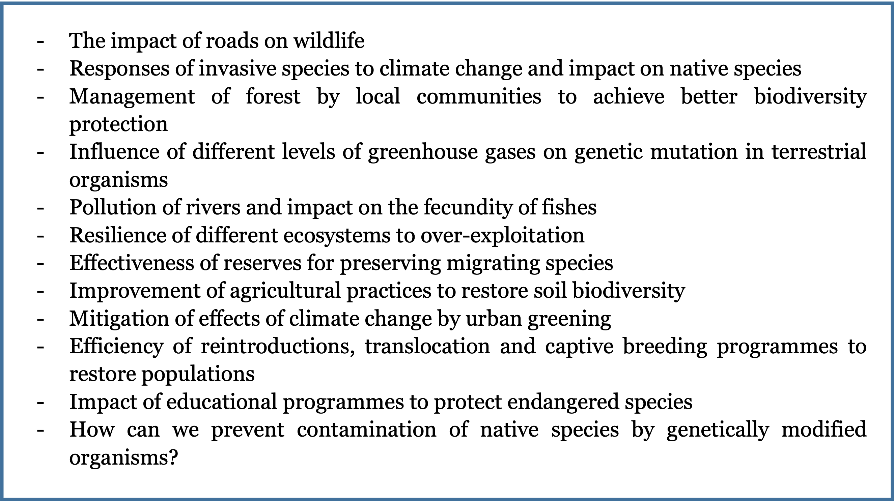
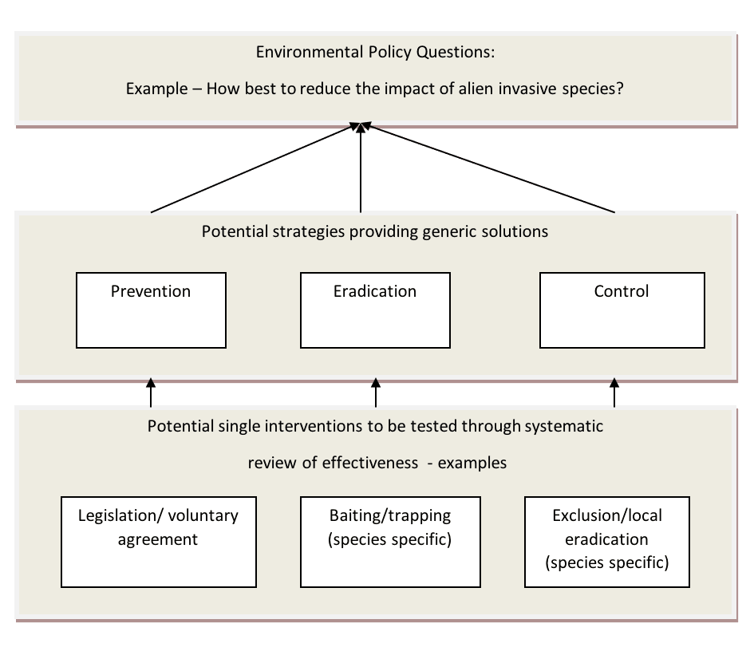

---
format:
  html:
    toc: true
    toc-depth: 3
    number-sections: true
bibliography: refs.bib
crossref:
  chapters: true
  custom:
    - kind: float
      key: box
      reference-prefix: Box
params:
  last_updated: ""
execute:
  echo: false
---

# Identifying the need for evidence, determining the evidence synthesis type, and establishing a Review Team {#sec-chapt2}

## **Determining the need for evidence**

In trying to find solutions to problems, the cause of a change, or to decide among alternative interventions to achieve desired outcomes, individuals or groups may identify a need for evidence. This chapter provides generic guidance on how to identify evidence needs to inform decision making. In doing so we provide some guidance on the initial steps that may, or may not, result in the planning and commissioning of a CEE Evidence Synthesis. It is not our intention here to describe the policy process or how management decisions are made.

The need for evidence relating to a question of concern (e.g. to policy or practice) can arise in many ways, ranging from the scientific curiosity of individual researchers to global policy development. Identifying and agreeing priority issues and the need for evidence to inform decisions are often iterative processes involving dialogue among many different individuals and organisations. In the process of deciding how to spend limited resources to achieve objectives, there is an opportunity for that decision to be informed by the best available evidence. Identifying exactly what evidence would help decision-making is therefore worth some thought and discussion.

The question addressed by a CEE evidence synthesis often arises from a concern, a challenge, a conflict or a decision that needs to be taken, for which the decision-makers would like to be informed by the best available evidence. Often, decision-makers would like to know how to intervene to solve a problem or what evidence is available to help them make the best decision. They may like to know whether evidence has accumulated, studies or trials have been conducted, or effects have been measured.

Questions arise in many forms and examples of common generic question types are listed in @tbl-commontype. Examples of scenarios that might generate a need for evidence are shown in @box-initial-concerns.

|  |  |
|----|----|
| **Answer being sought** | **Example question** |
| Greater understanding or predictive power | What is the role of biodiversity in maintaining specific ecosystem functions (e.g. biogeochemical cycles)? Here, a specific problem may be assessed to know whether it is really a problem and, if so, how big it is, and what are the significant drivers of changes. |
| Impacts of exposure to anthropogenic stressors | What is the impact of wind farm installations on bird populations? This type of request often addresses the effect of an exposure to a device, management practice or other stressor (e.g. pollutant) on biodiversity. |
| Socio-economic outcomes | What are the anticipated costs of the impacts of invasive species on health or agriculture? This type of request may require datasets collected by economists and social scientists, and their associated specific analytical tools. |
| Intervention effectiveness | How effective are marine protected areas at enhancing commercial fish populations? Very often commissioners will be eager to ask for a list of possible interventions or actions, with the evidence of their effectiveness or understanding of the conditions under which one action is effective or not. |
| Appropriateness of a method | What is the most reliable method for monitoring changes in carbon stocks in forest ecosystems? Here the question aims to identify which of several methods would be the most appropriate to provide guidelines for users and policy. |
| Optimal management options | What is the optimal grazing regime for maximizing plant diversity in upland meadows? Such a concern relates to efficiency or cost-effectiveness of an intervention or combination (“bundle”) of actions. |
| Optimal ecological or biological state | What is the desirable state of forest in terms of the distribution of deadwood and other biodiversity-relevant structures? This addresses values and philosophical approaches; the need for evidence would relate to the relationship between the state and its outcomes (e.g. ecosystem services) |
| Opinion or perception | Is there public support for badger culling in the UK? Datasets for this type of question may come from opinion polls or surveys, rather than experimental studies. |
| Ecological or geographical distribution | How has the distribution and abundance of rabies in fox populations changed in the last 10 years? Here one could ask if there is any evidence of change and whether it is homogeneous across spatial and temporal scales and species. |

: **Common types of policy problems and concerns in Environmental Management** {#tbl-commontype}

::: {#box-initial-concerns}
Examples of initial concerns or problems that might generate potential questions for evidence synthesis but are not yet sufficiently well defined.

:::

Initial questions arising from discussions of evidence needs are typically broad, sometimes complex, and possibly not well defined (termed ‘open-framed’ questions), whereas questions appropriate for Systematic Review are typically specific, well defined, and relatively simple (termed ‘closed-framed’ questions). Systematic Maps can often be better suited to broader questions. A discussion on how to progress from evidence need to evidence synthesis is provided in @sec-question, with further explanation and examples of the difference between open-framed and closed-framed questions given in @sec-open.

## **Getting people involved** {#sec-people}

In progressing from evidence needs to consideration of a specific question and planning of a CEE Evidence Synthesis it is likely that several different groups will have an interest in being involved. The group of people that identify a need for evidence may not be the group that undertakes a synthesis (except where the question is entirely scientifically motivated). There are at least four definable, but not mutually exclusive, groups that could be involved in the conduct of a synthesis from this early stage:

**The User Group** (Client, Commissioner, Requester) – policy or practice groups that identify the need for evidence and might commission an Evidence Synthesis and/or use its findings in the context of their work.

**The Review Team** – the group that conducts the synthesis; the authors of the synthesis report. We retain the term ‘Review Team’ for convention but the terms ‘Project Team’ or ‘Synthesis Team’ could also be used.

**The Stakeholder Group** – all individuals and organisations that might have a stake in question formulation and findings of the synthesis.

**CEE** – the independent organisation that oversees the conduct, peer review and endorsement of the synthesis process and synthesis report based on these Guidelines and Standards.

Various definitions of stakeholders exist in the literature, with perhaps the most widely cited one being “any group or individual who is affected by or can affect the achievement of an organisation’s objectives” [@FREEMAN1984_stakeholdermanagementastra]. In their framework for stakeholder engagement, @HADDAWAY2017_aframeworkforstakeholderen define systematic review stakeholders across three factors: actors, roles, and actions: in this way, one stakeholder group may have a diverse set of ways to engage with a review. Using a broad, encompassing definition of stakeholders can help to ensure that all relevant stakeholders are engaged, particularly minority groups.

Normally, to ensure independence of conduct and avoid conflicts of interest, any individual would not be a member of more than one of these groups (unless the potential conflict of interest has been accepted by all parties). Funding will often come from the User Group but can come from any one of these groups or be entirely independent. Funders must always be declared along with any other conflicts of interest that might arise (see @sec-chapt4 & @sec-chapt10).

The User and the Stakeholder Groups will have a very important role in the formulation of the review question, and in its phrasing but should not be directly involved in conducting the Evidence Synthesis. They may also help to establish the list of sources of evidence and search terms (by providing some of them, or checking the list for completeness). Involving many people at an early stage may be particularly critical if the findings are likely to be contested [@FAZEY2004_canmethodsappliedinmedicin]. However, particularly for a Systematic Review, stakeholder input needs to be carefully managed to avoid the question becoming too broad, complex or just impossible to answer [@STEWART2012_involvementinresearchwithou]. There are further opportunities throughout the review process for input from stakeholders, but as we shall see below, identifying and obtaining initial consensus on the question is crucial to the value of an evidence synthesis.

Evidence syntheses can greatly benefit from engaging with stakeholders to ensure that inputs and outputs are of the greatest relevance and reliability to all interested parties. Stakeholder engagement should reflect the broader methodology of evidence synthesis in the sense that it be conducted in a reliable, transparent way that aims to be as verifiable and objective as possible. Objectivity and repeatability can seem difficult goals when working with people who may have strong and diverse views. But by aiming for transparency and clarity, stakeholder engagement can be a reliable and verifiable process: these are key tenets of the parallel process of evidence synthesis.

The ways in which stakeholders can engage with a review are outlined in @fig-stakeholder-benefits. Stakeholder engagement can have a substantial impact on the reviewers, the review and the stakeholders, and reviewers should ensure they plan these activities carefully to ensure the do no harm and carefully consider the ethics of who and how they engage.

![Model of potential benefits of stakeholder engagement [@HADDAWAY2017_aframeworkforstakeholderen]. The model shows the direction of benefit with respect to stakeholders: green arrows benefit the review, and orange arrows benefit the stakeholders.](images/Fig-2.2-new.png){#fig-stakeholder-benefits}

Stakeholder engagement should be seen as a continual process that begins at the planning stages and continues through to communication of review/map findings. Careful and continued stakeholder engagement can help to increase the relevance and salience of environmental research and reviewers should carefully consider how to do so before submitting their protocols to CEE.

## **From a problem to a reviewable question:** **Question generation and formulation** {#sec-question}

As potential questions are generated, and review teams are formed, there will be a final process of question formulation. There is no set formal process for this, but some critical elements are set out in this section.

Each evidence synthesis starts with a specific question whereas evidence needs are typically much broader. For commissioners and decision makers, finding the right question to inform decisions can be a compromise (probably more so in environmental sciences than in most other disciplines) between taking a holistic approach, involving a large number of variables and increasing the number of relevant studies, and a reductionist approach that limits the review’s relevance, utility and value [@PULLIN2009_linkingreductionistsciencea]. There can be a temptation to try to squeeze too much information out of one synthesis by including broad subject categories, multiple interventions or multiple outcome measures (this can be dealt with by first conducting a Systematic Map if time and resources allow). Equally, there may be a tendency to eliminate variables from the question so that a Systematic Review is feasible but its utility or ‘real world’ credibility (external validity – see @sec-chapt7) is limited. The formulation of the question is therefore of paramount importance for many reasons. For example:

-   a Systematic Review question must be answerable using scientific methodology, otherwise relevant primary studies are unlikely to have been conducted

-   the question should be generated by, or at least in collaboration with, relevant decision-makers (or organisations) for whom the question is real, to ensure its validity to inform.

-   it may also be important for the question to be seen as neutral (unbiased) to stakeholder groups to minimise conflicts and encourage participation.

-   definitions of the structural elements of the question (see next section) are critical to the subsequent process because they generate the terms used in the literature search and determine relevance (eligibility) criteria.

The wording of the question and the definitions of question elements may be vital in establishing stakeholder consensus on the relevance of the synthesis. Ideally, meetings should be held with key stakeholders to try to reach consensus on the nature of the question. We recommend that experts in the field are consulted. Ideally, a meeting would invite some of them to present the state-of-the-art on the topic of interest so that each participant (especially Review Team members that are not subject experts) could be familiarised with the context, technical jargon and challenges.

### **Open-framed and closed-framed questions** {#sec-open}

As can be seen from the examples in Box 1, initial questions arising from discussions of evidence needs are often broad and may be rather “fuzzy” in that they often lack clear structural elements. For example, a question asking generally about the impact of roads on wildlife does not clarify what types of wildlife are of interest (e.g. terrestrial, aquatic, microorganisms, macro-organisms), their characteristics (e.g. individuals, populations, or communities), what types of impact are of concern (e.g. on abundance, dispersal, reproduction), or whether it matters what kinds of road (e.g. rural lanes, motorways) are considered. So, it would not be possible for a Review Team to specify which types of evidence are needed to provide a meaningful answer to the question. Such questions may be suitable for configurative Systematic Mapping but for Systematic Reviews to be feasible there needs to be sufficient structure in a question so that specific types of evidence relevant to the question (known as **key elements**) can be sought in order for an aggregative synthesis to be possible.

In the process of **question formulation** an initial, broad, policy question is broken down into more specific questions that are sufficiently well-structured to be amenable to evidence synthesis. In the case of the example of the impacts of roads on wildlife above, a refined version might be “what is the impact of motorways on populations of endemic bird species in Europe?” This question clearly has some structure to it now, as some key elements are specified, meaning that we can see which types of evidence relating to roads and birds we should be looking for. However, more thought needs to be given to this question for it to make full sense. If we are aiming to assess an impact of a motorway, we would need to have a comparator condition as a reference. This key element is rarely explicitly specified in the question. But we could further refine the question, for example by stating that we would require primary studies that had compared bird-habitats containing motorways against similar bird-habitats without motorways. We would also need to specify the “outcome” key element (e.g. population abundance, or breeding success). The resulting question may then be: What is the impact of habitats containing motorways on the breeding success of endemic European birds, as compared to habitats without motorways? In principle, this question would be amenable to an evidence synthesis @tbl-roads.

|  |  |  |
|----|----|----|
| **Question** | **Key elements** | **Question type** |
| Starting question: What is the impact of roads on wildlife? | None specified other than roads (vague), wildlife (vague) and impact (vague) | Open-framed (possible for Systematic Mapping but unsuitable for Systematic Review) |
| Refined question: What is the impact of motorways on populations of endemic bird species in Europe? | Motorways (=exposure), European endemic bird species (=population); but comparator and outcome not specified | Open-framed (suitable for Systematic Mapping but unsuitable for Systematic Review) |
| Further refined question: What is the impact of habitats containing motorways on the breeding success of endemic European bird species, as compared to habitats without motorways? | Motorways (=exposure), no motorways (=comparator), European endemic bird species (=population), breeding success (=outcome) | Closed-framed (suitable for Systematic Mapping and possible for Systematic Review) |

: **Example of question formulation: roads and wildlife**{#tbl-roads}

In the above example we started with a broad question with almost no structure and refined the question to a point where it contained structural elements, but not quite enough structure that would permit a meaningful Evidence Synthesis. This type of question (i.e. lacking some or all of the required structural key elements) is known as an **open-framed question**. Such questions are normally not answerable in a single experimental study and therefore not answerable through an aggregative synthesis of similar studies. Further refinement of the open-framed question provides a well-structured question amenable for Systematic Review and, since all necessary key elements are now clearly specified, this is known as a **closed-framed question.**

Breaking down open-framed to identify closed-framed questions can be a valuable exercise in a policy context. The process can identify basic units of evidence that can be accumulated through Systematic Review and subsequently combined to inform higher-level decisions. @PULLIN2009_linkingreductionistsciencea have outlined a process adapted from the health sciences. Essentially two stages are involved as outlined in @fig-policy-questions. The first requires that potential strategies for addressing open-framed questions are identified and the second that potential interventions are considered that would help deliver each strategy. The effectiveness of these interventions can then be the focus of a Systematic Review. Systematic Mapping can be used to inform the first stage and address an open-framed question, whereas Systematic Reviews might subsequently consider the effectiveness of individual interventions.

{#fig-policy-questions}

### **Key elements of questions amenable to evidence synthesis**

Although Systematic Review methodology was initially developed to test the effectiveness of interventions, its use has broadened considerably and the methodology is now also used to address a range of different types of questions that may have different key elements. Those key-elements are essential for the planning and conduct of any evidence synthesis, as they are going to guide and structure all the steps of the process, from literature search to critical appraisal.

The terminology widely used in evidence synthesis to define key-elements is referred as PICO or PECO, which describe Population, Intervention (or Exposure), Comparator and Outcomes. Other related question structures have been proposed and might be more applicable to some kinds of questions. SPICE (Setting, Perspective, Intervention, Comparator, Evaluation method) is an example that might be applicable to some questions suitable for CEE Systematic Reviews [see @BOOTH2004_formulatinganswerablequestio].

The question illustrated in \@tbl-roads is a comparative question. As such, it has four key elements which would need to be specified for it to be answerable (whether by a primary study or an Evidence Synthesis). These are: the population (P) of interest (endemic European birds); the exposure (E) of interest (motorways within habitat); the comparator (C) of interest (habitats without motorways); and the outcome (O) of interest (breeding success). This “PECO” type of question structure is very common. In cases where the exposure element is intentional, i.e. called an “intervention” (I), then the “PICO” acronym may be used instead, although PECO and PICO essentially indicate an identical question structure (@tbl-peco).

Another example, illustrating a PICO-type question is ‘**are marine protected areas effective at conserving commercial fish stocks?’** In this case the key elements could be:

P = Populations of commercially important fish species,

I = Establishment of marine protected area,

C = Area with no protection or limited protection

O = Relative change in fish populations

|  |  |
|----|----|
| **Question element** | **Definition** |
| Population (of subjects) | Unit of study (e.g. ecosystem, species) that should be defined in terms of the statistical populations of subject(s) to which the intervention will be applied. |
| Intervention/exposure | Proposed management regime, policy, action or the environmental variable to which the subject populations are exposed. |
| Comparator | Either a control with no intervention/exposure or an alternative intervention or a counterfactual scenario. |
| Outcome | All relevant outcomes from the proposed intervention or environmental exposure that can be reliably measured |

: **Elements of a reviewable PICO/PECO question: normally a permutation of ‘does intervention/exposure I/E applied to populations of subjects P produce a different amount of a measurable outcome O when compared with comparator C?** {#tbl-peco}

|  |  |  |  |
|----|----|----|----|
| **Question Type** | **Question** | **Question Elements** | **Example Elements** |
| Effect of intervention or exposure – “PECO” or “PICO” Structure | “What are the human wellbeing impacts of terrestrial protected areas?” (Pullin et al. 2013) | Population | Local human populations |
| Intervention | Terrestrial protected areas/associated integrated development projects |  |  |
| Comparator | Absence of PAs |  |  |
| Outcome | Measures of human wellbeing |  |  |
| What are the impacts of reindeer/caribou (Rangifer tarandus) on arctic and mountain vegetation?” (Bernes et al. 2013) | Population | Vegetation in alpine/subalpine areas and arctic/subarctic tundra |  |
| Exposure | Herbivory by reindeer/caribou |  |  |
| Comparator | No/less herbivory by reindeer/caribou |  |  |
| Outcome | Vegetation change (assemblage or specific groups) |  |  |
| Analytical accuracy (diagnostic test accuracy) – “PIT” structure | “Comparison of methods for the measurement and assessment of carbon stocks and carbon stock changes in terrestrial carbon pools? (Petrokofsky et al. 2010) | Population | Forest ecosystems |
| Test being evaluated (Index test) | Estimates of carbon content |  |  |
| Target Condition | Carbon release or sequestration from ecosystem change |  |  |
| Prevalence, occurrence, incidence – “PO” structure | “What is the rate of occurrence of rabies in foxes in various European countries?” | Population | Red fox populations |
| Outcome | Prevalence of rabies |  |  |

: **Examples of questions amenable to evidence synthesis and broken down into their key elements.**{#tbl-elements}

Decision makers may often seek more than just an aggregate answer (e.g. a mean impact of an intervention) to the primary question.  **Secondary question elements**, that follow on from the primary question, such as the cost-effectiveness of interventions; the prediction of reasons for variance in effectiveness (when or where will it work or not work?); the appropriateness and acceptability of particular interventions; and the factors which might influence the implementation of interventions ‘in the real world’ as opposed to the laboratory may be of equal or even greater importance. In many cases this might mean that the review essentially follows the ‘effectiveness’ review format but with development of synthesis strategies tailored to address a range of sub-questions. Discussion with funders and stakeholders is important at the beginning of the process to identify the type of evidence needed, to assess whether or not an effectiveness type of evidence synthesis is the most appropriate.

**Further examples of question formulation**

**Example 1:**

*Concern/Problem –* Protected areas (PAs) must ‘at least do no harm’ to human inhabitants (V^th^ IUCN World Parks Congress, Durban 2003), but previously some PAs have been documented to have negative effects on humans living inside and around their borders. The Scientific and Technical Advisory Panel (STAP) of the Global Environment Facility (GEF) wanted to know how PAs affected human wellbeing and whether impacts had changed over time and with different governance structures.

*Question Development* – Terrestrial protected areas were considered distinct from marine in the context of human impacts. The Systematic Review would include established and new PAs and intrinsically linked development projects. All outcomes relating to measures of human wellbeing were deemed relevant. The commissioners decided that the target populations would include all local human populations living both within and around the PA, with ‘local’ being defined as broadly as up to and including a national level. A cutoff of 1992 was chosen for published studies, since all PAs had to conform to IUCN category guidelines established at the Convention on Biological Diversity in Rio de Janeiro, 1992.

*Final Systematic Review Question –* What are the human wellbeing impacts of terrestrial protected areas?

*Lesson Learnt –* With hindsight this question should be have been approached through systematic mapping, largely because of the many different ways that exist for measuring impact of human wellbeing.

**Example 2:**

*Concern/Problem –* Lowland peatland ecosystems constitute vast amounts of carbon storage relative to their geographical extent. Extraction and drainage of peat for fuel and agriculture can release greenhouse gases (GHG; CO~­2~, CH~4~ and N~2~O) and other carbon stores, contributing to global warming. Rewetting and wetland restoration aim to ameliorate these destructive practices, but their effectiveness is uncertain. Whilst upland peat systems are relatively well-understood, no synthesis concerning lowland peats has been undertaken to date.

*Question Development –* The commissioners decided to focus the subject of a previous Systematic Review topic from all peatlands onto temperate and boreal regions and widen the scope from water level changes to all changes in land management. Carbon fluxes and greenhouse gases were kept as relevant outcomes.

*Final Systematic Review Question –* How are carbon stores and greenhouse gas fluxes affected by different land management on temperate and boreal lowland peatland ecosystems?

**Example 3:**

*Concern/Problem –* What intensity of grazing should be recommended to conserve biodiversity whilst ensuring economic sustainability of reindeer herding? An early view that reindeer were responsible for overgrazing in northern parts of Scandinavia has changed, with current opinion being that the observed overgrazing was localized and short-lived. In contrast, some are now concerned that grazing levels are insufficient to control mountain vegetation. Stakeholders identified a need to clarify a vague political dogma and goal; that the Swedish mountains should be characterised by grazing.

*Question Development –* Development of the review question (initially suggested by the Swedish Environmental Protection Agency, SEPA) was undertaken by a team of scientists in consultation with stakeholders. Any impact resulting from herbivory by reindeer or caribou (both *Rangifer tarandus*) from anywhere in their natural or introduced range was chosen to be included in the scope of the review. Herbivory in coniferous forests was excluded, however, since the review was to be focused on mountain and arctic regions.

*Final Systematic Review Question –* What is the impact of reindeer/caribou (*Rangifer tarandus*) on mountain and arctic vegetation?

## **Systematic Review or Systematic Map?** {#sec-map-rev}

The approaches to planning and conducting Systematic Reviews and Systematic Maps are similar in many ways but as forms of evidence synthesis they differ in their outputs. Systematic Reviews usually aim answer a question by collating and synthesising findings of individual studies in order to produce an aggregate measure of effect or impact. Systematic Maps do not aim to answer a specific question, but instead collate, describe and map findings in terms of distribution and abundance of evidence, often configured in relation to different elements of a question [@GOUGH2012_anintroductiontosystematic; @james2016]. As shown in @tbl-key-aspects, both methods share the same initial steps and differ primarily in their analytical approaches and outputs.

|  |  |  |
|----|----|----|
|  | **Systematic Review** | **Systematic Map** |
| **Protocol** | Mandatory | Mandatory |
| **Systematic searching** | Mandatory | Mandatory |
| **Systematic study selection** | Mandatory | Mandatory |
| **Critical appraisal of study validity** | Mandatory, to ensure robustness of the review answer – directly influences the data synthesis and interpretation steps | Optional (possible if study validity indicators can be captured using the coding method) – does not influence mapping process itself |
| **Data coding and extraction** | Mandatory, Meta-data coded and outcome measures (e.g. effect sizes) extracted. | Mandatory, metadata only coded. No extraction of outcome measures (e.g. effect sizes). |
| **Data synthesis approach** | Aggregative, seeking an unbiased answer with known precision; could involve meta-analysis | Exploratory; may include coding and group analysis |
| **Typical output** | A quantitative or qualitative answer with an indication of uncertainty and any threats to validity. May include estimate of variance caused by external factors. | A description of the evidence base, showing the distribution and abundance of evidence across different elements of the question. A relational database may be provided. |

: **Key aspects of Systematic Reviews and Systematic Maps**{#tbl-key-aspects}

When starting with a broad policy problem, it may not be immediately obvious whether a question can be developed that is suitable for Systematic Review or Systematic Mapping. This may become clearer as the question formulation process proceeds. If commissioners are seeking an answer that needs to be as precise as possible (or at least with uncertainty quantified) and free from bias this would signal the need for a Systematic Review. Alternatively, if commissioners are aware that the evidence base is broad and heterogeneous, they may seek information about the characteristics of the evidence base before deciding on how to proceed with their policy objectives. In such a situation it may be evident that the focus should be on conducting a Systematic Map rather than a Systematic Review.

The key characteristics of both CEE Systematic Reviews and Systematic Maps are rigour, objectivity and transparency. These characteristics serve to minimise bias and work toward consensus among stakeholders on the status of the evidence base.

There are different motivations for conducting Systematic Reviews and Systematic Maps. The latter are often preliminary syntheses of the evidence relating to a broader question that may subsequently inform more specific aggregative syntheses in the form of Systematic Reviews. Here we consider in more detail the decision makers’ or commissioners’ perspective and address the problem of deciding whether a Systematic Review or Systematic Map is the right option for informing their work.

*Some examples of when a Systematic Review may be appropriate are when:*

-   There is a need to measure the effectiveness of an intervention or relative effectiveness of interventions.

-   There is a need to measure the impact of an activity on a non-target population.

-   There is a need to know the quantity and quality of research that has been conducted on a specific question.

-   There are opposing views about the effectiveness of interventions or impact of actions.

-   There is a need to consider the relative effectiveness and cost of interventions.

*Systematic Maps may be a more suitable approach than Systematic Reviews when:*

-   A descriptive overview is required of the evidence base for a given topic

-   The question is open-framed such as ‘what interventions have been used to decrease the impact of commercial fishing on marine biodiversity?’

-   The question is closed-framed but there are multiple subject populations, interventions and outcomes to consider such as ‘what are the impacts of agri-environment schemes on farmland biodiversity?’

-   Preliminary mapping is a useful stage to assess where evidence may be sufficient or lacking for further synthesis.

*Systematic Reviews or Maps may not be appropriate when:*

-   The question is poorly defined or too complex (but see @sec-map-rev)

-   The question is too simple (e.g. has species x been recorded in region y)

-   The question does not attract stakeholder (including scientific) interest (i.e. the rigour is not necessary)

-   The question is not judged sufficiently important to be cost-effective to answer

-   Very little good quality evidence exists but systematic confirmation of a knowledge gap will not be valued.

-   A similar Systematic Review or Systematic Map has recently been completed (but see updating @sec-update1 and @sec-updateSearch)

-   The question can be satisfactorily answered with less rigorous and less costly forms of evidence synthesis

Ultimately the choice of Systematic Review or Systematic Map may come down to a matter of judgement of the Commissioners and/or Review Team. If Systematic Reviews are likely to include multiple syntheses, e.g. where multiple population types, interventions, or outcomes are defined in the question, an alternative option may be to conduct a Systematic Map first. This may identify subsets of the evidence base which are of highest priority (e.g. policy relevance) for subsequent focused synthesis by a Systematic Review. CEE will consider related Systematic Maps and Systematic Reviews on a case by case basis subject to the methods meeting adequate standards of rigour. Systematic Reviews which have multiple populations, interventions and/or outcome elements may contain a preparatory level of mapping as an integral element. However, this should not be an excuse for making the Systematic Review too speculative and the Protocol needs to be quite clear about how the review will proceed from the preparatory mapping to aggregative synthesis stages. Systematic Maps should not contain any aggregative synthesis elements. When a Systematic Map is followed by a separate Systematic Review, each requires its own separate Protocol.

In Systematic Mapping, the searching and inclusion processes are conducted with the same comprehensive method as for a Systematic Review, but the process does not extend to detailed critical appraisal or data synthesis. Data are, however, extracted from included studies in order to describe important aspects of the studies using a standard template and defined keywords and coding. This approach is designed to capture information on generic variables, such as the country in which a study took place, the population focus, study design and the intervention being assessed. This standard and well-defined set of keywords and codes is essential whenever classifying and characterising studies in order for reviewers to pull out key aspects of each study in a systematic way. For an example of a published CEE Systematic Map see @RANDALL2012_theeffectivenessofintegrate. In this example, the Review Team examined the effectiveness of integrated farm management, organic farming and agri-environment schemes for conserving biodiversity in temperate Europe. Their Systematic Map searched for relevant information in accordance with typical Systematic Review methodology. Screening of abstracts was then undertaken and a searchable database created using keywording to describe, categorise and code studies according to their focus and methodology. This searchable database is hosted on the CEE website and is freely available. Once the research has been mapped in this way it is then possible to identify pools of research which may be used to identify more narrowly defined review questions. For an example of this approach see @BOWLER2009_theimportanceofnatureforh.

## **Establishing a Review Team**

Conducting a CEE Evidence Synthesis is a substantial piece of work and usually requires the input of a multidisciplinary team. Teams may consist of subject experts combined with review and synthesis methodology experts, such as information specialists or statisticians. Evidence syntheses are normally undertaken by a team because one person is unlikely to possess all the skills required to conduct all stages of the review and synthesis, or have the appropriate combination of subject and methodological expertise, and because several stages of the review require independent conduct or checking that requires two or more participants to minimise the risk of introducing errors or bias. The Review Team should normally have a designated Lead Reviewer or Review Co-ordinator who is experienced in the methodology and a person (may also be the Lead Reviewer) able to project manage the rest of the team. The involvement of subject experts in the team brings with it the potential for bias. Careful consideration should be given to independence of subject experts within Review Teams and conflicts of interest should be declared and avoided where possible.

It is preferable that the team is constituted before or during the establishment of the Protocol (\@sec-chapt4) so that the team feels ownership and responsibility for its content. The rigorous methodology employed in CEE Evidence Syntheses requires substantial investment in time and it is important that careful planning of timetables and division of work is undertaken using some key predictors of the likely size and scope of the review. Loss of commitment among Review Team members when the workload becomes evident is a common cause of Evidence Syntheses stalling or failing to reach completion.

## **Involving stakeholders**

Evidence Syntheses are driven by the question(s) they are trying to answer. Different people or organisations may view the question in different ways, perhaps from different ideological and theoretical perspectives. It is helpful therefore to involve a broad range of stakeholders at certain stages of an Evidence Synthesis so that different users’ viewpoints are considered. These Guidelines recognise the many different opinions, academic and otherwise, about what constitutes a stakeholder (see also @sec-people). The term is used rather broadly here to mean people from organisations or representative groups who sit somewhere in the spectrum that indicates the extent to which they can affect (or be affected by) the issue being addressed by the Evidence Synthesis. One of the main aims of any Evidence Synthesis is to be transparent, and this includes being transparent about why a synthesis has the focus that it does. A broad stakeholder involvement will help to establish clearly that the Evidence Synthesis was carried out in a way that attempted to remove the likely bias that would be introduced through a narrow, vested-interest, focus.  Some of the types of stakeholders who have contributed to Evidence syntheses and should be considered when planning a synthesis are:

-   Academics

-   Government decision-makers (national, local)

-   Intergovernmental decision makers

-   Private sector – businesses, service providers

-   Non-governmental or civil society organisations

-   The general public

Stakeholders can have a very important role in framing the review question. They can also help to establish the list of sources of evidence and search terms (e.g. by providing some of them, or checking the list for completeness). Involving many people at an early stage may be particularly critical if the findings are likely to be contested [@FAZEY2004_canmethodsappliedinmedicin]. Some Review Teams have found it useful to hold stakeholder workshops, usually at the question formulation stage, and sometimes also during the Protocol drafting stage of the synthesis, and the additional costs of such meetings should be considered during the planning stage.

## **Advisory Groups or Panels**

Review Teams and Commissioners may wish to use an Advisory Group or Panel to help make decisions about the conduct of the review. Advisory groups can include methodological and subject area expertise, and include potential review users. They are Stakeholders who are willing to commit time to help the review group make necessary but difficult decisions in relation to the review topic at key times in its development to help ensure that the evidence synthesis is relevant and as free from bias as possible. They can be help particularly in framing the review question or refining the extent of a review once the size of the relevant literature becomes known. Such decisions can benefit from input from a variety of perspectives. However, Advisory Group members should be asked to declare conflicts of interest in the same way as Review team members. The role of any Advisory Group should be clearly specified in the Protocol, including at which points in the evidence synthesis they will be involved and how.
