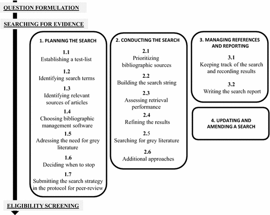

---
format:
  html:
    toc: true
    toc-depth: 3
    number-sections: true
bibliography: refs.bib
params:
  last_updated: ""
execute:
  echo: false
---
# Conducting a search {#sec-chapt4}

For Key CEE Standards for Conduct and Reporting a Search [click here](https://environmentalevidence.org/standards-table/)

## **Background**

To achieve a rigorous evidence synthesis, searches should be transparent and reproducible and minimise biases. A key requirement of a review team engaged in evidence synthesis is to try to gather a maximum of the available relevant documented bibliographic evidence in articles and the studies reported therein. Biases (including those linked to the search itself) should be minimized and/or highlighted as they may affect the outputs of the synthesis (Petticrew & Roberts, 2006; EFSA, 2010; Higgins & Green 2011). Failing to include relevant information in an evidence synthesis could significantly affect and/or bias its findings (Konno & Pullin 2020).\
The first step in planning a search is to design a strategy to maximise the probability of identifying relevant articles whilst minimizing the time spent doing so. Planning may also include discussions about eligibility criteria for subsequent screening (Frampton et al. 2017) as they are often linked to search terms. Planning should also include discussions about decision criteria defining when to stop the search as resource constraints (such as time, manpower, skills) may be a major reason to limit the search and should be anticipated and explained in the Protocol.

## Developing and testing a search strategy

Systematic and comprehensive searching for relevant studies is essential to minimise bias. The searching step requires careful planning and preparation and so most of this Section is devoted to this task. Enlisting an information specialist in the review team is recommended so that an efficient search strategy can be established. Aside from validity, a good search strategy can make a substantial difference to the time and cost of a synthesis. A step-by-step overview of the search process for evidence synthesis is illustrated in Figure 4.1

**Figure 4.1 A guide to the planning, conduct, management and reporting of the searching phase of systematic reviews and systematic maps (after Livoreil et al. 2017).**

In practice, it is unlikely that absolutely all of the relevant literature can be identified during an evidence synthesis search, for several reasons: (1) literature is often searched and examined only in those languages known to the project team; (2) some articles may not be accessible due to restricted access pay walls or confidentiality; (3) others lack an abstract or have unhelpful titles, which makes them difficult to identify; (4) others may simply not be indexed in a searchable database. Within these constraints, searches conducted for evidence synthesis should be as comprehensive as possible, and they should be documented so they can be repeated and readers can appreciate their strengths and weaknesses. Reporting any limitations to searches, such as unavoidable gaps in coverage (e.g. lack of access to some literature) is an important part of the search process, to ensure that readers have confidence in the review methods, and to qualify the interpretation of the evidence synthesis findings.

Steps involved in planning a search are presented in chronological order, bearing in mind that some of the process may be iterative. We also highlight the methods that enable the project team to identify, minimise and report any risks of bias that may affect the search and how this can affect the findings of an evidence synthesis.

We use the following terminology: **search terms** encompasses individual or compound words used in a search to find relevant articles. A search string is a combination of search terms combined using Boolean operators. A search strategy is the whole search methodology, including search terms, **search strings**, the bibliographic sources searched, and enough information to ensure the reproducibility of the search. **Bibliographic sources** (see below for more details) capture any source of references, including electronic bibliographic databases, those sources which would not be classified as databases (e.g. the Internet via search engines), hand searched journals, and personal contacts.

### Preventing errors and biases

Conducting a rigorous evidence synthesis implies to try to minimise risks of errors and biases which may happen at all stages. Errors that can occur during the search include: missing search terms, unintentional misspelling of search terms, errors in the search syntax (e.g. inappropriate use of Boolean operators, see below) and inappropriate search terms. Such problems may be minimised when the search term identification process is conducted rigorously, and by peer-reviewing the search strategy, including within and outside the project team, during development of the Protocol (See Section 3).

Biases (systematic errors) in the search strategy may affect the search outcomes (Song et al. 2010). The methods used to minimize bias should be reported in the Protocol and the final review or map. Minimizing bias may require 1) looking for evidence outside traditional academic electronic bibliographic sources (e.g. grey literature); 2) using multiple databases and search tools; and, 3) contacting organisations or individuals who may have relevant material (Bayliss & Beyer 2015). Some biases have been listed in Bayliss & Beyer (2015) and a few of them are reported here to be considered by project teams as appropriate: **language bias** (Song et al., 2010) means that studies with significant or ‘interesting’ results are more likely to be published in the English language and easier to access to than results published in other languages. The impacts of this on synthesis outcomes have been evaluated, and consequences of omitting non-English-language studies could be serious (e.g. providing a different direction of mean effect; Konno et al. 2020). The way to reduce the risk of language bias is to look beyond the English language literature. **Prevailing paradigm** bias (Bayliss & Beyer, 2015) suggests that studies relating to or supporting the prevailing paradigm or topic (for example climate change) are more likely to be published and hence discoverable. To reduce this bias Review Teams should not rely only on finding well known relevant studies. **Temporal bias** includes the risk that studies supporting a hypothesis are more likely to be published first (Bayliss & Beyer, 2015). The results may not be supported by later studies (Leimu and Koricheva, 2004). Due to the culture of ’the latest is best’, older articles may be overlooked and mis-interpretations perpetuated. The ways to reduce this bias include searching older publications, considering updating the search in the future, or test statistically whether this bias significantly affects the results of studies. **Publication bias** (Dickersin, 2005; Hopewell et al. 2007; Song et al., 2010) refers to asymmetry in the likelihood of publishing results: statistically significant results (positive results) are more likely to be accepted for publication than non-significant ones (negative results). This has been a source of major concern for systematic reviews and meta-analysis as it might lead to overestimating an effect/impact of an Intervention or Exposure on a Population (e.g. Gurevitch & Hedges, 1999; Rothstein et al. 2005; Lortie et al. 2007). To minimise this bias, searches for studies reporting non-significant results (most probably found in grey literature and studies in languages other than English) should be conducted in all systematic reviews and maps (Leimu & Koricheva 2005).

### Structuring the search with PICO/PECO elements

An evidence synthesis process starts with a question that is usually structured into “building blocks” (concepts or elements), some of which are then used to develop the search strategy. The search strategy illustrated below is based on PICO/PECO key elements which are commonly used in CEE evidence synthesis. Other elements and question structures exist (See Section 2). In any of these question structures it is possible to narrow the question (and the search) by adding additional search terms defining the Context or Setting of the question (e.g. “tropical”, “experimental”, or “pleistocene”). Searching for geographic location is not recommended because location names may be difficult to list or duplicate when the geographical range is broad, and because geographical information is not always mentioned in the title or abstract or keywords (which are generally used by search engines to identify relevant publications). Geographical elements (e.g. name of the country) may, instead, be more efficiently used as eligibility screening criteria (see below).

### Use of multiple languages

Identifying which languages are most relevant for the search may depend on the topic of the evidence synthesis. There are two main challenges with languages for an evidence synthesis: translating search terms into various languages to capture as many relevant articles as possible, and then being able to select and use the paper when not written in a language spoken by the project team members. In many electronic bibliographic sources, articles written in languages other than English can be discovered using English search terms. However, a large literature in languages other than English remains to be discovered in national and regional databases, e.g. CiNii for Japanese research. Searching is likely to require a range of languages when relevant articles are produced at national level, as much of it will be published in the official language of those nations (Corlett, 2011). Reporting the choice of language(s) in the Protocol and in the final synthesis report is important to enable repetition and updating when appropriate.

### Human resources needed for searching

Each evidence synthesis is conducted by a project team. It may be composed of a project leader and associated experts (thematic and methodological). Because of the systematic aspect of the searching and the need to keep careful track of the findings, project teams should, when possible, include librarians or information specialists. Subject specialist librarians are conversant with bibliographic sources, and are often very familiar with the nuances of different transdisciplinary and subject-specific resources (Zhang et al. 2006). They are aware of the broad range of tools available for undertaking literature searches and they are aware of recent improvements in the range and use of those tools. They are also expert in converting research questions into search strategies. Such experts can themselves benefit by contributing to a project team since their institutions may require demonstration of collaborative work (Holst & Funk 2005).

### Establishing a test-list

A **test-list** is a set of articles that have been identified as relevant to answer the question of the evidence synthesis (e.g. are within the scope and provide some evidence to answer the question). The project team should read the articles of the test-list to make sure they are relevant to the synthesis question. The test-list should be generated independently from your proposed search sources (databases etc) and can be created by asking experts, researchers and stakeholders (i.e. anyone who has an interest in the review question) for suggestions and by perusing existing reviews. Establishing a test-list is therefore independent of the search itself. It is used to help develop the search strategy and to assess the performance of the search strategy. Establishing a test-list by relying on a database planned for the full-search is not an independent test and will not help the review team to design an efficient search strategy.

The test-list should ideally cover the range of authors, journals, and research projects within the scope of the question. In order to be an effective tool it needs to reflect the range of the evidence likely to be encountered in the review. The number of articles to include in the test-list is a case-by-case decision and may also depend on the breadth of the question. When using a very small test-list, the project team may inappropriately conclude that the search is effective whilst it is not.

Using the test-list may be an indicator for the project team to improve the search strategy, or to help decide when to stop the search (See 4.2.11). The Review Team should report the performance of the search strategy (e.g. as a percentage of the test-list finally retrieved by the search strategy when applied in each electronic bibliographic source, e.g. Söderström et al. 2014, Haddaway et al. 2015). A high percentage is one indicator that the search has been optimized and the conclusions of the review rely on a range of available relevant articles that reflect at least those provided by the test-list. A low percentage would indicate that the conclusion of the review could be susceptible to change if other ‘missed’ articles are added. The test list should be fully captured when searches from all bibliographic sources are combined.

The performance of a search strategy should also be reported in a broader way, i.e. the extent to which all available relevant literature to answer the evidence synthesis question is likely to have been identified. The test-list should be presented in the Protocol submitted for peer-review.

### Identifying search terms

A search string that is efficient at finding relevant articles means that a maximum of relevant papers will have been found and the project team will not have to run the search again during the course of the conduct of the evidence synthesis. Moreover, it may be re-used as such when amending or updating the search in the future, saving time and resources. Initial search terms can usually be generated from the question elements and by looking at the articles in the test-list. However, authors of articles may not always describe the full range of the PICO/PECO criteria in the few words available in the title and abstract of their paper. As a consequence, building search strings from search terms requires project teams to draw upon both their scientific expertise, a certain degree of imagination, and an analysis of titles and abstracts to consider how authors might use different terminologies to describe their research.

Reading the articles of the test-list as well as existing relevant reviews often helps to identify search terms describing the population, intervention/exposure, outcome(s), and the context of interest. Synonyms can also be looked for in dictionaries. An advantage of involving librarians in the project team and among the peer-reviewers is that they bring their knowledge of specialist thesauri to the creation of search term lists. For example, for questions in agriculture, CAB Abstracts provides a thesaurus whose terms are added to database records. The thesaurus terms can offer broad or narrow concepts for the search term of interest, and can provide additional ways to capture articles or to discover overlooked words (http://www.cabi.org/cabthesaurus/). As well as database thesauri that offer terms that can be used within individual databases, there are other thesauri that are independent of databases. For example, the Terminological Resource for Plant Functional Diversity (http://top-thesaurus.org/) offers terms for 700 plant characteristics, plant traits and environmental associations. Experts and stakeholders may suggest additional keywords, for instance when an intervention is related to a special device (e.g. technical name of an engine, chemical names of pollutants) or a population is very specific (e.g. taxonomic names which have been changed over time, technical terminology of genetically-modified organisms). Other approaches can be used to identify search terms and facilitate eligibility screening (e.g. text-mining, citation screening, cluster analysis and semantic analysis) and are likely to be helpful for CEE evidence synthesis.

The search terms identified using these various methods should be presented as part of the draft evidence synthesis Protocol so that additional terms may be suggested by peer-reviewers. Once the list is finalised in the published Protocol it should not be changed, unless justification is provided in the final evidence synthesis report.

### Developing search strings

The development of effective search strings (combinations of key words and phrases) for searching should take place largely during the planning stage, and will most likely be an iterative process, testing search strings using selected databases, recording numbers of references identified and sampling titles for proportional relevance or **specificity** (the proportion of the sample that appears to be relevant to the Evidence Synthesis question). **Sensitivity** (the proportion of potentially relevant articles identified as estimated using the test list) should improve as testing progresses and reach 100% when results from databases are combined. A high-sensitivity and low-specificity approach is often necessary to capture all or most of the relevant articles available, and reduce bias and increase repeatability in capture (see below). Typically, large numbers of articles are therefore identified but rejected at the title and/or abstract screening stage.\
The iterative process may include considering synonyms, alternative spellings, and non-English language terms within the search strategy. An initial list of search terms may be compiled with the help of the commissioning organisation and stakeholders. All iterations of tested terms should be recorded, along with the number of references (hits) they return. This should be accompanied by an assessment of proportional relevance, so that the usefulness of individual search terms can easily be examined. Comparing search results when you include or exclude particular terms will allow you to identify superfluous or ineffective terms, and work out whether any should be removed from your search strategy. It is important to remember, however, that the functionality of different literature databases may vary considerably and terms that are apparently useful in one source will not always be appropriate in others: thus, search strings may need to be modified to suit each one.

Boolean operators (AND, OR, NOT) specify logic functions. They are used to group search terms into blocks according to the PICO or PECO elements, so that the search is structured and easy to understand, review and amend, if necessary. AND and OR are at the core of the structure of the search string. Using AND decreases the number of articles retrieved whilst using OR enlarges it, so combining these two operators will change the exhaustivity and precision of the search.

OR is used to identify bibliographic articles in which at least one of the search terms is present. OR is used to combine terms within one of the PICO elements, for example all search terms related to the Population. Using “forest OR woodland OR mangrove” will identify documents mentioning at least one of the three search terms.

AND is used to narrow the search as it requires articles to include at least one search term from the lists given on each side of the AND operator. Using AND identifies articles which contain, for example, both a Population AND an Intervention (or Exposure) search term. For instance, a search about a population of butterflies exposed to various toxic compounds and then observed for the outcomes of interest can be structured as three sets of search terms combined with AND as follows: “(lepidoptera OR butterfly OR coleoptera OR beetle) AND (toxi\* OR cry\* OR vip3\* OR Bacillus OR bt) AND (suscept\* OR resist\*)”. Note: truncating words with\* at 3 characters (e.g. cry\* in this example) may find lots of irrelevant words and may not be recommended.\
NOT is used to exclude specified search terms or PICO elements from search results. However, it can have unanticipated results and may exclude relevant records. For this reason, it should not usually be used in search strategies for evidence synthesis. For example, searching for ‘rural NOT urban’ will remove records with the word ‘urban’, but will also remove records which mention both ‘rural’ AND ‘urban’.

Proximity operators (e.g. SAME, NEAR, ADJ, depending on the source) can be used to constrain the search by defining the number of words between the appearance of two search terms. For example, in the Ovid interface “pollinators adj4 decline\*” will find records where the two search terms “pollinators” and “decline” are within four words of each other. Proximity operators are more precise than using AND, so may be helpful when a large volume of search results are being returned.

In the larger bibliographic databases and services it is possible to save searches and **set up an alert service** that will periodically run the saved searches and return new records. This can be useful if the testing occurs well in advance of the synthesis, or if the synthesis runs over a long period of time.

### Assessing the volume of literature

The volume of literature arising from test searches may be used as a predictor of the extent of the evidence base and a crude predictor of its strength (number of rigorous studies). For example, whether the review question is likely to identify a knowledge gap (very few articles), seems too broad and should be broken down or targeted toward a systematic map approach (very many diverse articles covering a range of populations, interventions and/or outcomes), or if it has the potential to provide an answer to the question as it is currently phrased and with the resources highlighted by the scoping exercise (nothing needs to be changed). This has implications in terms of the time and resources required to complete the review. Note, however, that the total number of returned articles is likely to reflect the specificity of the chosen search terms (and possibly searching skills of the Review Team) and is only an indicator. This can then be used to extrapolate and determine the likely quantity (but not quality) of articles relevant to the review question. The volume of literature that is likely to be difficult to access (in languages unfamiliar to the Review Team, or in publications that are not available electronically or not readily available in libraries) should, if possible, be assessed at this stage.

### Identifying relevant sources of articles

Various sources of articles relevant to the question may exist. Understanding the coverage, the functions and limitations of information sources can be time-consuming, so involving a librarian or information specialist at this stage is highly recommended. We will use **bibliography** to refer to a list of articles generally described by authorship, title, year of publication, place of publication, editor, and often, keywords as well as, more recently, DOI identifiers. A **bibliographic source** allows these bibliographies to be created by providing a search and retrieval interface. Much of the information today is likely to come from searches of electronic bibliographic sources, which are becoming increasingly comprehensive with the passage of time as more material is digitised. Here we use the term electronic bibliographic source in the broad sense. It includes individual **electronic bibliographic sources** (e.g. Biological Abstracts) as well as platforms that allow simultaneous searches of several sources of information (e.g. Web of Science, Lens.org, etc.) or could be accessed through search engines (such as Google). Platforms are a way to access databases.

### Coverage and accessibility

Several sources should be searched to ensure that as many relevant articles as possible are identified (Avenell et al., 2001; Grindlay et al. 2012). A decision needs to be made as to which sources would be the most appropriate for the question. This mostly depends on the disciplines addressed by the question (e.g. biology, social sciences, other disciplines) and the identification of sources that may provide the greatest quantity of relevant articles for a limited number of searches and their contribution in reducing the various biases. The quantity of results given by an electronic bibliographic source is NOT a good indicator of the relevance of the articles identified and thus should not be a criterion to select or discard a source. Information about access to databases and articles (coverage) can be obtained directly from the project team by sharing knowledge and experience, asking librarians and information experts and, if needed, stakeholders. Peer-review of the evidence synthesis Protocol may also provide extra feedback and information regarding the relevance of searching in some other sources.

Some sources are open-access, such as Google Scholar, whereas others require subscription such as Scopus. Therefore, access to electronic bibliographic sources may depend on institutional library subscriptions, and so availability to project teams will vary across organisations. A diverse project team from a range of institutions may therefore be beneficial to ensure adequate breadth of search strategies. When the project team does not have access to all the relevant bibliographic sources, it should explain its approach and list the sources that were available but not searchable and acknowledge these limitations. This may include indications as to how to further upgrade the evidence synthesis at a later stage.

### Types of sources

In this subsection we first present bibliographic sources which allow the use of search strings, mostly illustrated from the environmental sciences. An extensive list of searchable databases for the social sciences is available in Kugley et al. (2016). Other sources and methods mentioned below (such as searches on Google) are complementary but cannot be the core strategy of the search process of an evidence-synthesis as they are less reproducible and transparent.

Bibliographic sources may vary in the search tools provided by their platforms. Help pages give information on search capabilities and these should be read carefully. Involving librarians who keep up-to-date with developments in information sources and platforms is likely to save considerable time.

***Electronic bibliographic sources***\
The platforms which provide access to bibliographic information sources may vary according to:

1.  Platform issues\
    • the syntax needed within search strings and the complexity of search strings that they will accept\
    • access: not all bibliographic sources are completely accessible. It depends on the subscriptions available to the project team members in their institutions. The Web of Science platform, for example, contains several databases, and it is important to check and document which ones are accessible to the project team via that platform.

2.  Database issues\
    • disciplines: subject-based bibliographic sources (CAB ebooks; applied life sciences, agriculture, environment, veterinary sciences, applied economics, food science and nutrition) versus multidisciplinary sources (Scopus, Web of Science);\
    • geographical regions (e.g. Latin America, HAPI-Hispanic American Periodicals Index, or Europe CORDIS). It may be necessary to search region-specific bibliographic sources if the evidence-synthesis question has a regional focus (Bayliss & Beyer, 2015);\
    • document types: scientific papers, conference or proceedings, chapters, books, theses. Many university libraries hold digital copies of their theses, such as the EThOS British Library thesis database. Conference papers may be a source of unpublished results relevant for the synthesis, and may be found through the BIOSIS Citation index or the Conference Proceedings Citation Index (Glanville, 2019)\
    • durations at the time of writing, in the Web of Science Core Collection some articles may be accessible from 1900 although by no means all, in Scopus they may date from 1960);\
    Publishers’ databases

The websites of individual commercial publishers may be valuable sources of evidence, since they can also offer access to books, chapters of books, and other material (e.g. datasets). Using their respective search tools and related help pages allows the retrieval of relevant articles based on search terms. For example, Elsevier’s ScienceDirect and Wiley Interscience are publishers’ platforms that give access to their journals, their tables of contents and (depending on licence) abstracts and the ability to download the article.

*Web-based search engines*

Google is one example of a web-based search engine that searches the Internet for content including articles, books, theses, reports and grey literature. It also provides its own search tools and help pages. Such resources are typically not transparent (i.e. they order results using an unknown and often changing algorithm, Giustini & Boulos, 2013) and are restricted in their scope or in the number of results that can be viewed by the user (Google Scholar). Google Scholar has been shown not to be suitable as a standalone resource in systematic reviews but it remains a valuable tool for supplementing bibliographic searches (Bramer et al. 2013; Haddaway et al. 2015) and to obtain full-text PDF of articles. BASE Bielefeld academic search engine (https://www.base-search.net) is developed by the University of Bielefeld (Germany) and gives access to a wide range of information, including academic articles, audio files, maps, theses, newspaper articles, and datasets. It lists sources of data and displays detailed search results so that transparent reporting is facilitated (Ortega 2014).

Full-text documents will be needed only when the findings of the search have been screened for eligibility and retained based on their title and abstract, and need to be screened at full-text (see Frampton et al. 2017). Limited access to full-texts might be a source of bias in the synthesis, and finding documents may be time-consuming as it may involve inter-library loans or direct contact with authors. Documents can be obtained directly if (a) the articles are open-access, (b) the articles have been placed on an author’s personal webpage, or (c) are included in the project team’ institutional subscriptions. Checking institutional access when listing the sources of bibliography may help the project team anticipate needs to get extra support.

***Grey literature sources***

“**Grey literature**” relates to documents that may be difficult to locate because they are not indexed in usual bibliographic sources (Konno & Pullin 2020). It has been defined as “manifold document types produced on all levels of government, academics, business and industry in print and electronic formats that are protected by intellectual property rights, of sufficient quality to be collected and preserved by libraries and institutional repositories, but not controlled by commercial publishers; i.e. where publishing is not the primary activity of the producing body” (12th Int Conf On Grey Lit. Prague 2010, but see Mahood et al., 2014). Grey literature includes reports, proceedings, theses and dissertations, newsletters, technical notes, white papers, etc. (see list on http://www.greynet.org/greysourceindex/documenttypes.html). This literature may not be as easily found by internet and bibliographic searches, and may need to be identified by other means (e.g. asking experts) which may be time-consuming and requires careful planning (Saleh et al. 2014).

Searches for grey literature should normally be included in evidence synthesis for two main reasons: 1) to try to minimize possible publication bias (Hopewell et al. 2007), where ‘positive’ (i.e. confirmative, statistically significant) results are more likely to be published in academic journals (Leimu and Koricheva 2005); and 2) to include studies not intended for the academic domain, such as practitioner reports and consultancy documents which may nevertheless contain relevant information such as details on study methods or results not reported in journal articles often limited by word length.

More and more documents are being indexed including those in the grey literature (Mahood et al. 2014). Nevertheless, conducting a search for grey literature requires time and the authors should assess the need to include it or not in the synthesis (Haddaway and Bayliss 2015). Repeatability and susceptibility to bias should be assessed and reported as much as possible.

There are some databases or platforms which reference grey literature. INIST (Institute for Scientific and Technical Information, France) holds the European OpenSIGLE resource (opensigle.inist.fr), which provides access to all the SIGLE records (System for Information on Grey Literature), new data added by EAGLE members (the European Association for Grey Literature Exploitation) and information from Greynet. HAL (https://hal.archives-ouvertes.fr) is a French CNRS open access scientific repository from research teams all over the world, including thesis and Protocols of reviews. There are also some programs which can help to make web-based searches for grey literature more transparent, a practice that is part of “scraping methods” (Haddaway 2015). Examples of sources available for grey literature:

-   BASE (https://www.base-search.net) allows the selection of document types and provides the option to focus on unpublished material

-   eu provides access to more than 700.000 bibliographical references of grey literature produced in Europe.

-   Zenodo is an open-access repository initially linked to European projects. It welcomes research outputs from all over the world and all disciplines, including grey literature. It allows search by keywords and includes publications, thesis, datasets, figures, posters, etc.

Examples of sources providing access to theses and dissertations include: DART-Europe (free); Open Access Theses and Dissertations (free); ProQuest Dissertations and Theses (http://pqdtopen.proquest.com/, upon subscription); OAISTER; EThOS (British Library, free); WorldCat.org (free); OpenThesis.org (free, dissertations/theses, but does include other types of publications). Further resources can be found at http://www.ndltd.org/resources/find-etds. Individual universities frequently provide access to their thesis collections.

*Websites of organisations and professional networks*

Many organisations and professional networks make documents freely available through their web pages, and many more contain lists of projects, datasets and references. The list of organisations to be searched is dependent upon both the subject of the evidence synthesis and any regional focus (see examples in Land et al. 2013; Ojanen et al. 2014; Soderström et al. 2014; Bottrill et al. 2014). Many websites have a search facility but their functionality tends to be quite limited and must be taken into consideration when planning for the time allocated to such task.

Examples:

-   TROPENBOS is a non-governmental agency created in the Netherlands in 1986. It contributes to the establishment of research programmes in tropical forestry and it has its own website with many documents, including proceedings of workshops, books and articles that contain useful datasets and references. tropenbos.org

-   Databases such as ScienceResearch.com and AcademicInfo.net, contain links to hand-selected sites of relevance for a given topic or subject area and are particularly useful when searching for subject experts or pertinent organisations, helping to focus the searching process and ensure relevance.

*Asking authors, experts and colleagues*

Direct contact with knowledge-holders and other stakeholders in networks and organisations may be very time-consuming but may allow collection of very relevant articles (Bayliss & Beyer 2015; Schindler et al. 2016). This can be especially useful to help access older or unpublished data sources, when the research area is sensitive to controversy (e.g. GMO, Frampton, pers. comm.) or when resources are limited (Doerr et al. 2015). This may also help enable access to articles written in languages other than English.

*World-wide web*

Search engines (e.g. Google, Yahoo) cannot index the entire web, and they differ widely in the order of their results. They all have their own algorithms favouring different criteria and both retrieval and ranking of results may be affected by the location, the device used to search (mobile, desktops), the business model of the search engine and commercial purposes. It is important to use more than one search engine to increase chance to identify relevant papers. Google Scholar is often used to scope for existing relevant literature but it cannot be used as a standalone resource for evidence synthesis (see 1.3.2, Bramer et al. 2013; Haddaway et al. 2015)

*Additional approaches: hand-searching, snowballing and citation searching*

Hand-searching is a traditional (pre-digital) mode of searching which involves looking at all items in a bibliographic source rather than searching the publication using search terms. Hand-searching can involve thoroughly reading the tables of contents of journals, meeting proceedings or books (Glanville, 2019).

Snowballing and citation searching (also referred to as ‘pearl growing’, ‘citation chasing’, ‘footnote chasing’, ‘reference scanning’, ‘checking’ or ‘reference harvesting’) refer to methods where the reference lists contained within articles are used to identify other relevant articles (Sayers 2007). Citation searching (or ‘reverse snowballing’) uses known relevant articles to identify later publications which have cited those papers on the assumption that such publications may be relevant for the review.

Using these methods depends on the resources available to the Review Team (access to sources, time). Hand-searching is rarely at the core of the search strategy, but snowballing and citation searching are frequently used (e.g. McKinnon et al. 2016). Recent developments in some bibliographic sources automatically highlight and allow the user to link, to cited and related articles when viewing (e.g. when scanning Elsevier journals, or when downloading full-text PDF). This may be difficult to handle as those references may or may not have been found by the systematic approach using search strings and may have to be reported as additional articles. The use of those methods and their outputs should be reported in detail in the final evidence-synthesis.

### Choosing bibliographic management software

Bibliographic searches may produce thousands or sometimes tens of thousands of references that require screening for eligibility and so it is important to ensure that search results are organised in such a way that they can be screened efficiently for their eligibility for an evidence synthesis. Key actions that will be necessary before screening can commence are to assemble the references into a library, using one or more bibliographic reference management tool(s); and to identify and remove any duplicate references.

**Assembling references**\
A range of bibliographic reference management tools are available into which search results may be downloaded directly from bibliographic databases or imported manually, and these vary in their complexity and functionality. Some tools, such as Eppi Reviewer (Social Science Research Unit, 2016) and Abstrackr (Rathbone et al. 2015) include text mining and machine learning functionality to assist with some aspects of eligibility screening. According to recently-published evidence syntheses and Protocols, the most frequently-used reference management tools in CEE evidence syntheses are Endnote and Eppi Reviewer (sometimes used in combination with Microsoft Excel), although others such as Mendeley and Abstrackr are also used. Given that reference management tools have diverse functionality and are continually being developed and upgraded, it is not possible to recommend any one tool as being ‘better’ than the others. An efficient reference management tool should:

-   enable easy removal of duplicate articles, which can reduce substantially the number of articles;

-   readily locate and import abstracts and full-text versions for articles where available;

-   enable the review team to record their screening decisions for each article;

-   enable articles, and any screening decisions accompanying them, to be grouped and analysed to assist the team in checking progress with eligibility screening and in identifying any disagreements between screeners.

Other features of reference management tools that review teams may find helpful to consider are: whether the software is openly accessible (e.g. Mendeley) or may require payment (e.g. Endnote, Eppi Reviewer); the number of references that can be accommodated; the number of screeners who can use the software simultaneously; and how well suited the tool is for project management tasks, such as allocating eligibility screening tasks among the review team members and monitoring project progress.

Good documenting, recording and archiving of searches and their resulting articles may save a substantial amount of time and resource by reducing duplication of results and enabling the search to be re-assessed or amended easily (Higgins & Green 2011). Good recording ensures that any of the limitations of the search are explicit and hence allows assessment of any possible consequences of those limitations on the synthesis’ findings. Good archiving enables the Review Team to respond to the queries about the search process efficiently. If a Review Team is asked why they did not include an article in their review, for example, proper archiving of the workflow will allow the team to check whether the article was detected by the search, and if it was, why it was discarded.\
Good documenting, recording and archiving has two main aspects: (1) the clear recording of the search strategy and the results of all of the searches (records) and (2) the way the search is reported in the evidence synthesis Protocol and final report. Reporting standards keep improving (see a comparative study in Mullins et al. 2014) and many reporting checklists exist to help Review Teams (Rader et al. 2014). See Section 10 for CEE reporting standards.

### Deciding when to stop

If time and resources were unlimited, the project team should be able to identify all published articles relevant to the evidence-synthesis question. In the real world this is rarely possible. Deciding when to stop a search should be based on explicit criteria and it should be explained in the Protocol and/or synthesis report. Often, reaching the budget limit (in terms of project team time) is the key reason for stopping the search (Saleh et al. 2014) but justification for stopping should rely primarily on the acceptability of the performance of the search for the project team (See 4.3.1). Searching only one database is not considered as adequate (Kugley et al. 2016). Observing a high rate of article retrieval for the test-list should not preclude the conduct additional searches in other sources to check whether new relevant papers are identified. Practically, when searching in electronic bibliographic sources, search terms and search strings are modified progressively, based on what is retrieved at each iteration, using the “test-list” as one indicator of performance. When each additional unit of time spent in searching returns fewer relevant references, this may be a good indication that it is time to stop the search (Booth 2010). Statistical techniques, such as capture-recapture and the relative recall method, exist to guide decisions about when to stop searching, although to our knowledge they have not been used in CEE evidence-synthesis to date (reviewed in Glanville, 2019).

For web-searches (e.g. using Google) it is difficult to provide specific guidance on how much searching effort is acceptable. In some evidence syntheses, authors have chosen a “first 50 hits” approach (hits meaning articles, e.g. Smart & Burling 2001) or a ‘first 200 hits’ approach (Ojanen et al. 2014), but the CEE does not encourage such arbitrary cut-offs. What should be reported is whether stopping the screening after the first 50 (or more) retrieved articles is justified by a decline in the relevance of new articles. As long as relevant articles are being identified, the project team should ideally keep on screening the list of results.

## Conducting the Search

Once the search terms and strategy have been reviewed and agreed in the published Protocol, the review team can conduct the search by implementing the whole search strategy.

### Prioritizing bibliographic sources

Glanville et al. (in press) suggests that the Review Team should start the search using the source where the largest number of relevant papers are likely to be found, and subsequent searches can be constructed with the aim to complement these first results. Sources containing abstracts allow greater understanding of relevance and should be given priority. Combined with the use of the test-list, ordering the use of sources may allow the Review Team to find the largest number of relevant articles early during the search, which is useful when time and resources are limited. Searching the grey literature can be conducted in parallel with searches in sources of indexed documents.

### Modifying the search string

The list of search terms needs to be combined into search strings that retrieve as many relevant results as possible (comprehensiveness) while also limiting the number of irrelevant results (precision). This will first be done at the Protocol stage (see Section 3). However, search strings needs to be modified (usually simplified) to match the functionality of each electronic bibliographic source to be searched (e.g. Haddaway et al. 2015). To modify the string, the team should consult the syntax available in the help pages of the bibliographic sources, including details of the limitations on use of Boolean operators, where applicable. All modification should be fully recorded and reported.\
The search syntax is the set of options provided in the interface of the bibliographic source to achieve searches. The syntax options can usually be found in the help pages of the bibliographic source interface.

Typical syntax features are listed below and will vary by interface:

-   **Wildcards and truncation:** symbols used within words or at the end of the root of the word to signal that the spelling may vary. Wildcards are useful within words to capture British and US spelling variants, for example ‘behavi?r’ in some interfaces will retrieve records containing ‘behaviour’ as well as ‘behavior’. As well as wildcards within words, many interfaces offer truncation options at the end of word stems. Truncation can help with identifying words with plural and various grammatical forms. For example, ‘forest\*’ in some bibliographic sources will retrieve records containing forest, forests, forestry, forestal… Some options can also be further defined, for example in the Ovid interface ‘forest\$1’ can be used to restrict searches to words with no or one extra character.

-   **Parentheses** are used, where provided, to group search terms together (e.g. a set of synonyms linked by a Boolean operator, see below) and they determine the sequence in which search operations will be carried out by the interface. Search string operations within parentheses are, typically, carried out before those that are not enclosed within parentheses. In complex search strings, nesting of groups of search terms within different sets of parentheses may be helpful, and the search operation is then performed first on the search terms that are within the innermost set of parentheses. In this sense, parentheses as used in search strings function in a similar way to those used in mathematical calculations. For example: (road\*OR railway\*) AND (killing OR mortality) (for more explanations about OR, see Boolean operators below).

-   **Phrase searching**: Some database interfaces allow words to be grouped and searched as phrases by using, for example, double quotation marks. For example, “organic farming”, “tropical forest”.

-   **Lemmatization**: lemmatization involves the automated reduction of words to their respective “lemmas” (roots). For example, the lemma for the words “computation” and “computer” is the word “compute”. When using defense as a search term, it would also find variants such as defence. Lemmatization can reduce or eliminate the need to use wildcards to retrieve plurals and variant spellings of a word, but it may also retrieve irrelevant variants (e.g. cite as a search term may retrieve articles with citing, cities, cited and citation, Web of Science helpfile). Web of Science automatically applies lemmatization rules to Topic and Title search queries. This facility is not available in all interfaces.

### Refining the results

The finalised search extracts a first pool of articles that is a mixture of relevant and irrelevant articles, because the search, in trying to capture the maximum number of relevant papers, inevitably captures other articles that do not attempt to answer the question. Screening the outputs of the search for eligibility will be done by examining the extracted papers at title, abstract and full-text (See Section 5). If the volume of search results is too large to process within available resources, the Review Team may consider using some tools provided by some electronic databases (e.g. Web of Science) to refine the results of the search by categories (e.g. discipline, research areas) in order to discard some irrelevant articles prior to extracting the final pool of articles and thus lower the number of articles to be screened. There is a real risk in using such tools, as removing articles based on one irrelevant category may remove relevant papers that also belong to another relevant category. This can occur because categories characterise the journal rather than each article and because we are relying on the categories being applied consistently. As a consequence, using refining tools provided by electronic bibliographic sources should be done with great caution and only target categories that are strongly irrelevant for the question (e.g. excluding PHYSICS APPLIED, PERIPHERAL VASCULAR DISEASE or LIMNOLOGY in a search about reintroduction or release of carnivores). The test-list is again an indicator of the performance of the strategy when using such tools. If by using these tools, the retrieved set of articles loses some of the test-list papers previously retrieved, then the tools need to be readjusted to correct this before the retrieval of the final set of articles is completed. If the Review Team do use such tools, they should report all details of tools used in order to allow replicability and discuss the limitations of the approach they have used.

### Keeping track of the search strategy and recording results

The Review Team should document its search methodology in order to be transparent and to be able to justify their use of a search term or the choice of resources. Enough detail should be provided to allow the search to be replicated including the name of the database, the interface, the date of the search and the full search with all the search terms, which should be reported exactly as run (Kugley et al. 2016). The search history and number of articles retrieved by each search should be recorded in a logbook or using screenshots and may be reported in the final evidence synthesis (e.g. as supplementary material). The number of articles retrieved and screened and discarded should be recorded in a flow diagram (see ROSES template) and this should accompany the reporting of the search and eligibility screening stages within an evidence-synthesis report.\
For internet searches, reviewers should record and report the URL, the date of the search, the search strategy used (search strings with all options making the search replicable), as well as the number of results of the search, even if this may not be easily reproducible. Saving search results as HTML pages (possibly as screenshots to allow archiving that can be perused later even if the webpage has changed in the meantime) provides transparency for this type of search (Haddaway et al. 2017). Recording searches in citation formats (e.g. RIS files) makes them compatible with reference or review management software and allows archiving for future use.

### Reporting the final search strategy and findings

Although the search strategy will have been listed in the Protocol, the searches as finally run should be reported in the final evidence synthesis report, possibly as additional files or supplementary information, since the search as finally run may be different from the Protocol. The final synthesis reports the results and performance of the search. Minor amendments to the Protocol (e.g. adding or removing search terms) should be reported in the final synthesis, but the search should not be substantially changed once approved by reviewers (but see below).\
The Review Team may report the details of each search string and how it was developed (e.g. Bottrill et al. 2014) and whether the strategy has been adjusted to the various databases consulted (e.g. Land et al. 2013, Haddaway et al. 2015) or developed in several languages (e.g. Land et al. 2013). Limitations of the search should be reported as much as possible, including the range of languages, types of documents, time-period covered by the search, date of the search (e.g. Land et al. 2013; Söderström et al. 2014), and any unexpected difficulty that impacted the search compared to what was described in the Protocol (e.g. end of access, Haddaway et al. 2015).

## Updating and Amending Searches {#sec-updateSearch}

Updating or amending a search may be conducted by the same Review Team that undertook the initial searches, but this is not always the case. Therefore, it is important that the original searches are well documented and, if possible, libraries (e.g. EndNote databases) of retrieved articles are saved (and, if possible, reported or made available) to ensure that new search results can be differentiated from previous ones, as easily as possible.

There are two main reasons why a search needs to be updated. The first may occur when the evidence synthesis extends over a long time period (for instance more than 2 years) and the publication rate of relevant documents on the topic is high. In this case, the conclusions of the review may be out of date even before it is published. It is recommended that the search is rerun using the same search strategy (Bayliss et al. 2016) for the time period elapsed subsequent to the end of the initial search and before the report is finalised. An alternative is the set up an alert service when running the search on a database, given that this service is provided, so that relevant articles are sent as soon as published and can be taken into account at a regular basis or when reaching key stages of the evidence synthesis (e.g just before data analysis and synthesis).

The second case occurs when the evidence synthesis final report has already been published, and there is a need for revision because new primary research data or developments have subsequently been published and need to be taken into account. In this case the search Protocol should be checked to identify whether new search terms need to be added or additional sources need to be searched. Deciding whether a new Protocol needs to be published will depend on the extent of the amendments and may be discussed with the Collaboration for Environmental Evidence. From the moment a search is completed, new articles may be published as research effort is dynamic.

There are a number of issues that need to be considered when updating a search:

-   Do you have access to the original search strings, sources, and can you read these files (proper software available)?

-   Was the original search Protocol adequate and appropriate or does it need revising?

-   Do you know when the initial search took place and which time boundaries were set up at that time? If not, can you contact the authors to get those details?

-   If relevant, do you have similar details regarding searches in grey literature?

-   Do you have access to the same sources of documents (e.g. database platforms), including institutional websites, subscriptions?

-   Will the same languages be used?

Then the revised (or original) strategy may be run (Bayliss et al. 2016). As with the original searches, it is important to document any updates to the searches, their dates, and any reasons for changes to the original searches, most typically in an appendix. If the new search differs from the initial one, a new Protocol may need to be submitted before the amendment is conducted (Bayliss et al. 2016).
