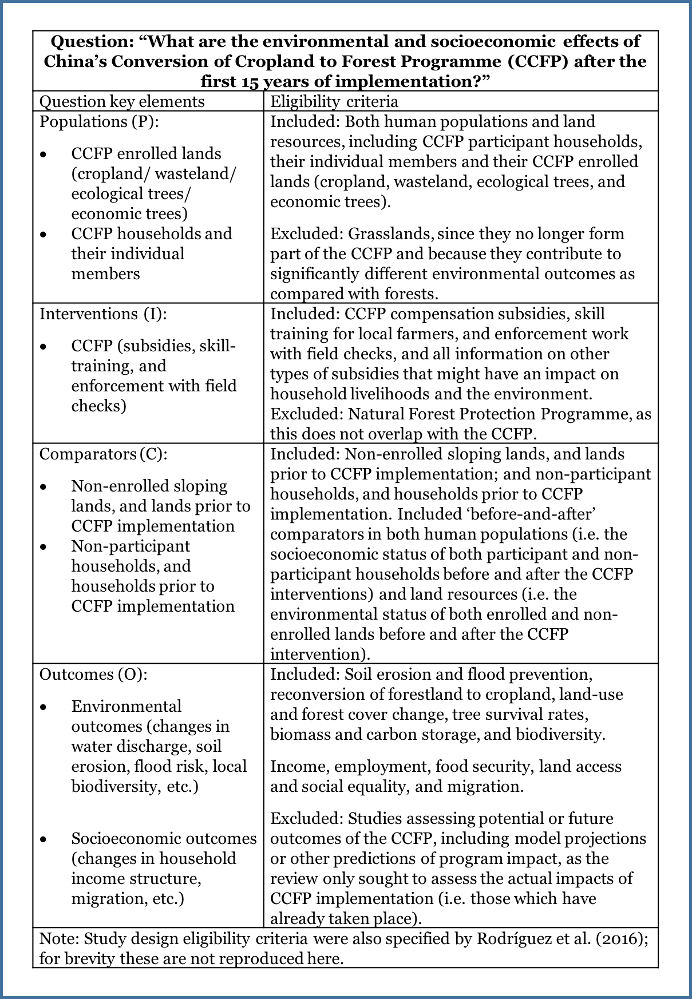
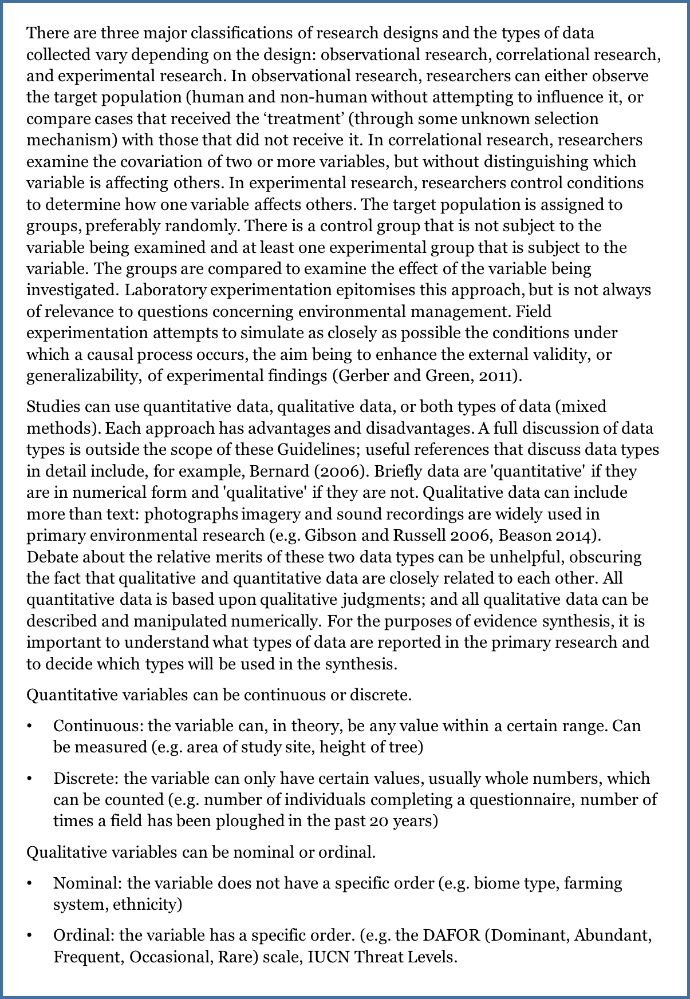

---
format:
  html:
    toc: true
    toc-depth: 3
    number-sections: true
bibliography: refs.bib
params:
  last_updated: ""
execute:
  echo: false
---

# Eligibility screening {#sec-chapt5}

For CEE Standards for conduct and reporting of article screening [click here.](https://environmentalevidence.org/standards-table/)

## Background

The eligibility screening step of a Systematic Review or Systematic Map (which may also be referred to as ‘study selection’, ‘evidence selection’ or ‘inclusion screening’) involves the application of eligibility criteria that determine which of the primary research studies identified in searches are relevant for answering the review or map question; and the use of a systematic screening process for applying the eligibility criteria to the search results in such a way as to minimise the risk of introducing selection bias (McDonagh et al., 2013). Both the eligibility criteria and the screening process should be planned in advance and specified in the evidence synthesis protocol.

### Developing and testing study eligibility criteria and eligibility screening

Once the search terms and strategy have been reviewed and agreed in the published protocol, the review team can conduct the search by implementing the whole search strategy.

### The Eligibility Criteria

#### *Rationale for eligibility criteria*

The use of pre-specified and explicit eligibility criteria ensures that the inclusion or exclusion of articles or studies from a Systematic Review or Systematic Map is done in a transparent manner, and as objectively as possible. This reduces the risk of introducing errors or bias which could occur if decisions on inclusion or exclusion are selective, subjective, or inconsistent. An objective and transparent approach also helps to ensure reproducibility of eligibility screening. Failing to consistently apply eligibility criteria, or using criteria which are not relevant to the evidence synthesis question, can lead to inconsistent conclusions from different evidence syntheses (e.g. illustrated by Englund et al. 1999 for stream predation experiments and McDonagh et al. 2014 for health research studies).

The eligibility criteria for a Systematic Review or Systematic Map should reflect the question being asked and therefore follow logically from the ‘key elements’ that describe the question structure. Many environmental questions are of the ’PICO‘ type, where the interest is on determining effects of an intervention within a specified population. For a PICO-type question the key elements (P, I, C, O) would specify which population(s), intervention(s), comparator(s) and outcome(s) must be reported in an article describing a primary research study in order for that article to be eligible for inclusion in the evidence synthesis (examples of PICO and other types of question structure are given by EFSA, 2010; Aiassa et al., 2016; and James et al., 2016).\
Developing the search strategy can in turn help define or refine eligibility criteria that will be used for the screening of the literature once the full search is conducted (see Section 5. Titles and abstracts and full text found during scoping (see Section 3) can form a sample of the literature within which papers that are not relevant (ineligible) for different reasons (including unexpected use of synonyms, or use of similar wording in other disciplines) may be identified and appropriate eligibility criteria developed. Planning eligibility criteria allows for discussion with the commissioner about the scope and scale of the articles that will be retained and the finalised eligibility criteria will be reported later on in the evidence synthesis Protocol.

An example of eligibility criteria for an environmental intervention (i.e. PICO-type) Systematic Review question is shown in Box 3.2, for the question ‘What are the environmental and socioeconomic effects of China’s Conversion of Cropland to Forest Programme (CCFP) after the first 15 years of implementation?’ (Rodríguez et al. 2016). As the example illustrates, eligibility criteria may be expressed as inclusion criteria and, if helpful, also as exclusion criteria.

#### Box 5.1 Example Systematic Review eligibility criteria in relation to question key elements for an intervention (PICO-type) environmental Systematic Review question (from Rodríguez et al., 2016)

Ideally, the eligibility criteria should be specified in such a way that they are easy to interpret and apply by the review team with minimal disagreement. For some Systematic Review or Systematic Map questions the eligibility criteria may be very similar to or identical to the question key elements and the question itself, whereas in other cases the eligibility criteria may need to be more specific, to provide adequate information for the review team to make selection decisions.

In the example Systematic Review question (Box 5.1) it is clear that if an article describing a primary research study did not provide information on the intervention (i.e. the Conversion of Cropland to Forest Programme) then it would not be appropriate for answering the review question. As such, the article could be excluded. Similarly, an article that did not report any environmental or socioeconomic outcomes would not be relevant and could be excluded. The example question illustrates that articles can be efficiently excluded if they fail to meet one or more inclusion criteria; they are included only if they meet all the eligibility criteria.

Keeping the list of eligibility criteria short and explicit, and specifying the criteria such that an article would be excluded if it fails one or more of the criteria is a useful approach since this minimises the range of information that members of the review team would need to locate in an article and means that if an article is clearly seen not to meet one of the criteria then the remaining criteria would not have to be considered. Since a single failed eligibility criterion is sufficient for an article to be excluded from an evidence synthesis, it may be helpful to assess the eligibility criteria in order of importance (or ease of finding them within articles), so that the first ‘no’ response can be used as the primary reason for exclusion of the study, and the remaining criteria need not be assessed (Higgins & Green, 2011).

The example in Box 5.1 is for a relatively broad Systematic Review question. For a Systematic Map the question may be even broader since the objective of a map is to provide a descriptive output. Irrespective of how broad the question is, the process for developing eligibility criteria which we have outlined here applies both to Systematic Reviews and Systematic Maps (James et al., 2016).

*Study design as an eligibility criterion*

The types of primary research study design (e.g. observational or experimental; controlled or uncontrolled) that can answer an evidence synthesis question will vary according to the type of question. The study design is sometimes made explicit in the key elements (e.g. ‘PICO’- type questions may be stated as ‘PICOD’ or ‘PICOS’ in the scientific literature, where ‘D’ (design) or ‘S’ (study) indicates that study design is being considered) (e.g. Rooney et al., 2014).

Even if study design is not explicit in the question structure it should be considered as an eligibility criterion for Systematic Reviews since the designs of studies that are included should be compatible with the planned approach for the data synthesis step (e.g. some meta-analysis methods may specifically require controlled studies). The type of study design may also be indicative of the likely validity of the evidence, since some study designs may be more prone to bias than others (see Box 5.2). Note that in Systematic Reviews the full assessment of risks of bias and other threats to validity takes place at the critical appraisal step, and this step should always be conducted irrespective of whether any quality-related eligibility criteria have been specified.*\
*

**Box 5.2 Overview of research designs**

### Pilot testing the eligibility criteria and screening process

The eligibility screening procedure should be pilot-tested and refined when developing the Protocol of the review or map. A typical approach is to develop an eligibility screening form that lists the inclusion and exclusion criteria, together with instructions for the reviewers, to ensure that each reviewer follows the same procedure. Eligibility criteria may vary depending on whether screening applies to titles, abstracts or full-text (see Section 5.4)

Several reviewers (at least two per article) apply the agreed study eligibility criteria to a sample of identified relevant articles. The sample of articles can be drawn randomly from preliminary searches conducted at the scoping stage, and include articles from the test-list (which are deemed to be eligible) or previous reviews.

Each reviewer is asked to make simple decisions about each article: to include the article, to exclude it, or to mark it as unclear whilst keeping track of which eligibility criteria triggered his decision. Reviewers screen the titles and/or abstracts and/or full text of the sample of articles independently from one another, and then compare their screening decisions to identify whether they are consistent. If necessary, the description of the criteria should be refined and re-tested until an acceptable level of agreement is reached. The finally agreed draft eligibility screening criteria should then be provided when the Protocol is submitted (see below).

Note that testing for consistency of screening between reviewers is also used when conducting the full screening after the full systematic search has been conducted. Here, it helps developing and refining the definition of the eligibility criteria, whilst later, it will be used to report consistency between reviewers as a proxy to minimise bias during screening.\
Pilot testing is important for validating reproducibility and reliability of the method. Pilot testing can:

-   check that the eligibility criteria correctly classify studies;

-   provide an indication of how long the screening process takes, thereby assisting with planning the full evidence synthesis;

-   enable agreement between screeners to be checked; if agreement is poor this should lead to a revision of the eligibility criteria or the instructions for applying them;

-   provide training for the review team in how to interpret and apply the eligibility criteria, to ensure consistency of understanding and application;

-   identify unanticipated issues and enable these to be dealt with before the methods are finalised.

If relevant articles are found to have been excluded, irrelevant articles are included, or a large number of ‘unclear’ judgements are being made by the review team, then the eligibility criteria should be revised and re-tested until an acceptable discrimination between relevant and irrelevant articles is achieved. The finally-agreed eligibility criteria should then be specified in the evidence synthesis Protocol.

## Removing duplicates

As a first step in screening, duplicate articles, that are common in search results, should be removed where possible before eligibility screening starts. Inclusion of duplicates in an evidence synthesis could lead to double-counting of data, which might introduce bias (Tramèr et al., 1997), as well as creating unnecessary additional screening effort. Many reference management tools enable automated identification and removal of duplicate articles (e.g. ‘fuzzy matching’ of references in Eppi Reviewer and this may be particularly helpful if large numbers of duplicates are present. However, care should be taken to avoid inadvertently removing articles which are not duplicates. If an automated process is used for identifying duplicates it should not be assumed that this will always classify the articles accurately.

## The screening process

### Rationale and overview of the screening process

The process of eligibility screening aims to ensure that the eligibility criteria are applied consistently and impartially so as to reduce the risk of introducing errors or bias in an evidence synthesis. Articles identified in searches are typically structured in having a title, an abstract (or summary), and/or a ‘full text’ version such as an academic journal paper, agency report, or internet pages. Eligibility screening can be applied at these different levels of reading to impose a number of filters of increasing rigor as well as saving time, and thus screening is normally a stepwise process. CEE recommends that at least two filters are applied: (i) a first reading of titles and abstracts to efficiently remove articles which are clearly irrelevant; and (ii) assessment of the full-text version of the article.

Depending on the nature of the evidence synthesis question and the number of articles requiring screening, titles and abstracts may be screened separately or together. If only an insignificant number of articles can be excluded on title alone (e.g. as found in a Systematic Review of the environmental impacts of poverty rights regimes by Ojanen et al. 2017), then combining the title and abstract screening in a single step may be more efficient. In cases where insufficient information is available in the title or abstract to enable an eligibility decision to be made, or if the abstract is missing, then the full-text version should be obtained and examined. CEE recommends that at least two filters are applied: (i) a first reading of titles and abstracts to efficiently remove articles which are clearly irrelevant; and (ii) assessment of the full-text version of the article. An overview of the eligibility screening process is shown in Figure 5.1.

##### [{alt=""}](https://environmentalevidence.org/wp-content/uploads/2017/12/Figure-6.1.png)**Figure 5.1. The eligibility screening process for Systematic Reviews or Systematic Maps**

As shown in Figure 5.1, the screening process starts with individual articles but final eligibility decisions are made at the level of studies, taking into account any linked articles that refer to the same study (see ‘Identifying linked articles’ below). The evidence selection decision process is conservative at each step so that only articles which do not meet the inclusion criteria are excluded; in any cases of doubt, articles proceed to the next step for further scrutiny. If after full-text screening the eligibility of a study remains unclear, further information should be sought, if feasible (e.g. by contacting the authors), to enable the study to be included or excluded. Any studies whose eligibility still remains unclear after this process should be listed in an appendix to the Systematic Review or Systematic Map report. In Systematic Reviews, an option could be to include studies of unclear relevance in a sensitivity analysis to see if their results affect the overall findings of the review. The approach for handling unclear studies should be considered during Protocol development and specified in the Systematic Review or Systematic Map Protocol.

A single set of eligibility criteria can be used to screen titles, abstracts and full-text articles (e.g. Rodriguez et al. (2016) used the eligibility criteria shown in Box 3.2 for screening titles and abstracts and then applied the same criteria to full-text articles). However, if the information reported in titles and abstracts is limited it may be efficient to use a smaller subset of the eligibility criteria to screen the titles and/or abstracts, and apply the more detailed full set of eligibility criteria for the screening of full-text articles. Whichever approach is used, the eligibility criteria applied at each step should be clearly stated in the Protocol.

### Identifying linked articles

If the same data are included more than once in an evidence synthesis this can introduce bias (Tramèr 1997; von Elm et al., 2003; Choi et al., 2014). Therefore, the unit of analysis of interest in a Systematic Review or map is usually individual primary research studies (e.g. observational studies, surveys, or experiments), rather than individual articles.

Investigators often report the same study in more than one article (e.g. the same study could be reported in different formats such as conference abstracts, reports or journal papers, or in several different journal papers; von Elm et al. 2004), and we refer to these as ‘linked articles’. Although there is often a single article for each study, it should never be assumed that this is the case (Higgins & Green, 2011). Linked articles may range from being duplicates (i.e. they fully overlap and do not contribute any new information) to having very little overlap (some data have been re-used for a new analysis ??). Articles which are true duplicates should be removed to avoid double-counting of data. The remaining linked articles which refer to a study should be grouped together and screened for eligibility as a single unit so that all available data pertinent to the study can be considered when making eligibility decisions.

It may be difficult to determine whether articles are linked, as related articles do not always cite each other (Bailey 2002; Barden et al., 2003) or share common authors (Gøtzsche 1989). Some ‘detective’ work (e.g. checking whether the same data appear in more than one article, or contacting authors) may therefore be needed by the review team. Although it would be ideal to identify linked articles that refer to the same study early on the screening process, it may only become clear at the full-text screening stage that articles are linked. Once the links between articles and studies have been identified, a clear record will need to be kept of all articles which relate to each study. This may be done using a separate document or spreadsheet, or using grouping or cross-referencing functions available in bibliographic reference management tools.

### Number and expertise of screeners

Eligibility decisions involve judgement and it is possible that errors or bias could be introduced during eligibility screening if the process is not conducted carefully.

Possible problems that could arise at the eligibility screening step are:

-   Some articles might be misclassified due to the way members of the review team interpret the information given in them in relation to the eligibility criteria;

-   One or more articles might be missed altogether, due to human error;

-   Review team members may (knowingly or not) introduce bias into the selection process, since human beings are susceptible to implicit bias and experts in a particular topic often have pre-formed opinions about the relevance and validity of articles (e.g. Higgins & Green, 2011; Gøtzsche & Ioannidis, 2012).

Appropriate allocation of the review team to the eligibility screening task, in terms of the number and expertise of those involved, is important to ensure efficiency (DEFRA, 2015) and can help to minimise the risk of errors or bias. If any members of the review team are authors of articles identified in the searches then the allocation of screening tasks should ensure that members of the review team do not influence decisions regarding the eligibility of their own articles.

*Number of screeners*

It has been estimated that when eligibility screening is done by one person, on average 8% of eligible studies would be missed, whereas no studies would be missed when eligibility screening is done by two people working independently (Edwards et al., 2002). To ensure reliability of the eligibility screening process, articles providing guidance on conducting Systematic Reviews in environmental research (EFSA, 2010; Rooney et al., 2014; Sargent & O’Connor, 2014) and health research (CRD, 2009; Higgins & Deeks, 2011; McDonagh et al., 2013) recommend that eligibility screening should be performed where possible by at least two people. The screeners need not necessarily be the same two people for all articles or for all screening steps. Options could be for one person to screen the articles and the second person to then check the first screener’s decisions; or both screeners may independently perform the selection process and then compare their decisions. Independent screening is preferable since it avoids the possibility that the second screener could be influenced by the first screener’s decision.

A potential problem with eligibility screening being conducted by a single screener is that any errors in the classification of articles by the screener, or any articles missed from classification, may go undetected, if checking by a second screener is not done on an adequate number of articles. Reliability checking can be done (e.g. using screener agreement statistics) but this has limitations which should be taken into consideration, as we explain below see ‘Assessing screener agreement’).

Eligibility screening can be a time-consuming process, typically taking an hour or more for a screener to assess 200 titles or 20 abstracts (DEFRA, 2015). If the evidence base is extensive such that large numbers (e.g. tens of thousands) of articles would need to be screened, it might not always be feasible for two or more screeners to work on all screening steps. Consideration may then need to be given as to whether the Systematic Review or Systematic Map question, or the eligibility criteria, should be refined (e.g. narrowing the scope) to make the evidence synthesis manageable within the available resources (see Section 2). Discussion with relevant stakeholders, e.g. research commissioners, may be helpful in resolving any difficulties if the level of rigor expected of eligibility screening will be difficult to achieve within the available resources. Employing a single screener at one or more steps of the eligibility screening process, subject to checking screener reliability, is a pragmatic approach which may be justifiable on a case-by-case basis depending on the nature of the topic and how critical it is to minimise the risk of selection bias (e.g. Langer et al., 2017), but should not be considered as being reflective of best practice (see ‘Assessing screener agreement’ below). It may be tempting to consider employing a single screener for titles, since the information available in a title is usually relatively limited and titles can often indicate that an article is irrelevant without the need to expend detailed effort in screening (DEFRA, 2015). However, selection bias could arise at title screening (just as it could at abstract or full-text screening) if a screener is not impartial, and this could be especially important for evidence syntheses on contentious topics. Furthermore, in our experience it is not uncommon for a small proportion (\~1%) of articles to be completely missed from screening by a single reviewer, due to human error (e.g. screener fatigue when assessing thousands of articles). For these reasons, good practice would be to employ a minimum of two screeners at the title screening as well as abstract and full-text screening steps.

For Systematic Maps the need to minimise selection bias may seem less critical than for Systematic Reviews, since the output and conclusions of Systematic Maps are often descriptive. Nevertheless, an underlying expectation of Systematic Maps is that the searching and eligibility screening steps should be conducted with the same rigor as for Systematic Reviews (James et al., 2016). It is therefore good practice in all types of evidence synthesis that at least two people conduct eligibility screening of each article. We recommend that deviations from this should only be made as exceptions, where clear justification can be provided, and is agreed among all relevant stakeholders. This is important for maintaining the integrity of systematic evidence synthesis as a ‘gold standard’ or ‘benchmark’ approach for minimising the risk of introducing errors or bias, and to avoid creating confusion as to whether the methods employed in specific evidence syntheses truly constitute those of a Systematic Review or Systematic Map, rather than, for example, a traditional literature review or rapid evidence assessment (DEFRA, 2015).

If a pragmatic decision is made by the review team to proceed with a Systematic Review or Systematic Map involving a large number of articles to screen and to use only one screener for some of the articles then, for consistency with good practice as defined above, the following information should be provided in the Protocol and final evidence synthesis report:

-   a clear justification for using one screener to screen all and a second to screen only a sample, stating which steps of the screening process this will be applied to;

-   evidence of the reliability of the approach (i.e. the reliability of the screener’s decisions should be tested and reported; see ‘Assessing screener agreement’ below);

-   acknowledgement that the use of one screener to screen all and a second to screen only a sample at one or more steps of eligibility screening is a limitation (this should be stated in the conclusions section, critical reflection or limitations section, and, if possible, also in the abstract).

Ultimately, it is the review team’s responsibility to ensure that, where possible, methods are used which minimise risks of introducing errors and bias, and that any limitations are justified and transparently reported.

There is no firm ‘rule’ about how many of the screeners should be topic experts. Given the complexity of environmental topics it is important that the team has adequate expertise in evidence synthesis and the question topic to ensure that important factors relating to the evidence synthesis question are not missed (DEFRA, 2015). However, topic experts may lack impartiality as they are likely to be very familiar with the literature relevant to the evidence synthesis question which may risk selective screening decisions being made (Gøtzsche and Ioannidis 2012). A pragmatic approach to reduce the risks of any conflicts of interest within a review team could be to include screeners with different backgrounds and expertise, to ensure diversity of stakeholder perspectives.

### Assessing screener agreement

An assessment of agreement between screeners helps to ensure that the eligibility screening process is reproducible and reliable (Frampton et al, 2017). If necessary, the eligibility criteria and/or screening process may be modified and re-tested to improve the agreement between screeners as long as deviation from the Protocol is explained and justified. Agreement can be assessed by: recording the observed proportions of articles where pairs of screeners agree or disagree on their eligibility decisions; calculating a reviewer agreement statistic; and/or descriptively tabulating and discussing any disagreements.

A widely used statistic for assessing screener agreement is Cohen’s kappa (Altman, 1991), which takes into account the level of agreement between screeners that would occur by chance. But interpretation of kappa scores is subjective since there is no consensus as to which scores indicate ‘adequate’ agreement, and the concept of ‘adequate’ agreement is itself subjective.\
To assess screener agreement, a sample (as large as possible) of the articles identified in searches should be screened by at least two people and their agreement determined. The size of the sample should be justified by the review team and the articles comprising the subset should be selected randomly to avoid bias towards certain authors, topics, years or other factors.

Use of a kappa statistic to guide pilot-testing of eligibility screening where two or more people will screen each article is a pragmatic approach to optimise efficiency of the process, in which case the limitations of the agreement statistic and its somewhat arbitrary interpretation are not critical. However, use of the kappa statistic to demonstrate high reviewer agreement in support of employing only one screener to assess the majority of articles is not advised. The potential insensitivity of overall screener agreement measures to specific discrepancies in screener agreement suggests that a kappa statistic might not be adequate as a justification that a single screener has sufficient reliability in their screening decisions to protect against the risk of introducing errors or selection bias.

As there is no consensus on what ‘adequate’ rates of agreement are (unless reaching 100%), the review team should justify the level of agreement reached and explain in the evidence synthesis report whether relying on a single screener may have led to any relevant studies being excluded. If so, an explanation should be given as to how this would affect interpretation of the evidence synthesis conclusions. Presentation of a decision matrix showing the combinations of screener agreements may be helpful to support any discussion and interpretation of screener reliability.

### Resolving disagreements

A process for resolving any disagreements between screeners should be agreed by the review team and to ensure consistency this should be pre-specified in the Protocol. An approach which appears to be commonly used (Peterson and bin Ali, 2011), and which works efficiently in our experience, is that the screeners meet to discuss their disagreements to reach a consensus; if consensus is not reached a third opinion could then be sought, from another member of the review team or the project advisory group. The exact approach is a matter of preference; for example, abstracts over which there is disagreement could be discussed by the screeners before proceeding to the full-text screening step (to avoid obtaining full-text articles unnecessarily), or the articles could be directly passed to the full-text screening step (to enable decisions to be based on all available information). Records of all screening decisions should be kept to ensure that, if necessary, the review team can justify their study selection. Screening decisions can often be recorded conveniently in user-definable fields in reference management tools. Pilot-testing the screening process, described below, can be helpful to identify whether some screeners differ systematically from others in the eligibility decisions they make.

## Recording and documenting eligibility screening

### Reporting the eligibility criteria, screening process and screening results

A concise summary of the eligibility criteria and screening process should be given in the final report, including in the abstract or summary. An explanation must be provided in the final report if the methods employed differed from those specified in the Protocol. It is particularly important to consider whether any changes to the Protocol could have introduced errors or bias.

It is good practice to include a flow diagram in the evidence synthesis report to show how many unique articles were identified (i.e. after removing any duplicates), and to indicate how many of these were excluded at the title, abstract and full-text screening steps (CRD, 2009; Liberati et al., 2009; EFSA, 2010; Higgins & Green, 2011; McDonagh et al., 2013; Rooney et al., 2014). The flow diagram should also clarify the relationship between articles and studies so that it is clear how many articles and unique studies were included in the Systematic Review or Systematic Map; and should give reasons why any studies were excluded at the full-text selection step. A template flow diagram is provided by the ROSES reporting standards.

The flow diagram template may be adjusted to display how the eligibility screening was conducted. For example, the diagram may be expanded to accommodate further panels if titles and abstracts are screened separately. In addition to the flow diagram, a list of the studies which were excluded at the full-text screening step should be provided, indicating the reasons for exclusion (e.g. as an appendix to the evidence synthesis report). Whilst the ROSES template indicates the minimum information on the results of eligibility screening that should be reported, some authors advocate specifying further information. For example, the flow diagram could include an indication of how many of the included studies contributed to any meta-analyses (e.g. Sagoo et al., 2009), or an indication of how many studies informed quantitative and qualitative analyses for the primary outcome of interest (e.g. Liberati et al., 2009; Higgins & Green, 2011).

Any definitions and instructions on interpretation of the eligibility criteria used by the review team should be reported at least in the Protocol. Details of the screening process which should be documented in the Protocol and also stated concisely in the evidence synthesis report are: the number of screeners involved at each eligibility screening step; whether screening decisions were independent; the expertise of the screeners; the pilot-testing process; any assessments of screener agreement, with justification for the methods chosen; the process employed for resolving any screener disagreements; and how any missing or unclear information was handled.

Any limitations in the eligibility screening process should be mentioned in the Discussion (or Critical Reflection) section of the final evidence synthesis report so that readers can consider them when interpreting the overall findings of the evidence synthesis (Liberati et al., 2009). If there are any serious limitations in the eligibility screening criteria or the screening process which could affect the overall conclusions of the Systematic Review or Systematic Map these should, where possible, also be mentioned in the abstract or summary.

### Keeping an archive of screening decisions

It is important that a record is kept of all eligibility screening decisions so that judgements made during conduct of the Systematic Review or Systematic Map are transparent and, if necessary, defensible (e.g. if any readers query why a particular study was not included). A record of the screening decisions should be saved (e.g. in a reference management tool or relational database) that can easily be interrogated to display articles which were included, excluded, or deemed unclear at each selection step. The tool or database containing the full set of screening decisions should be archived in such a way that it can be made available if requested by any readers of the Systematic Review or Systematic Map report.
