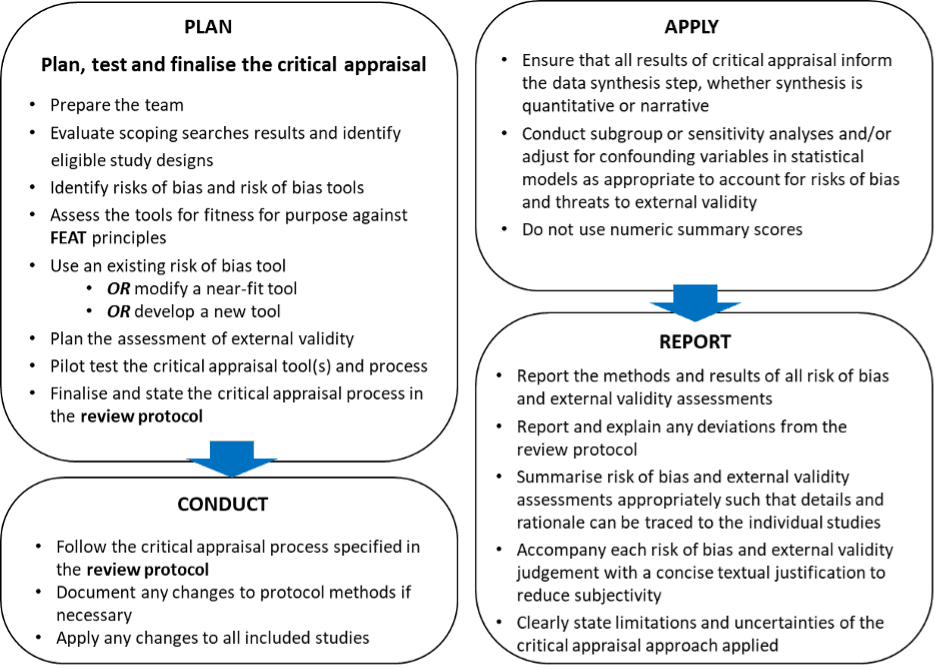

---
format:
  html:
    toc: true
    toc-depth: 3
    number-sections: true
bibliography: refs.bib
params:
  last_updated: ""
execute:
  echo: false
---

# Critical appraisal of study validity {#sec-chapt7}

For CEE Standards for conduct and reporting critical appraisal of study validity [click here.](https://environmentalevidence.org/standards-table/)

## **Background**

The critical appraisal stage of a Systematic Review (sometimes referred to as quality assessment) is the stage at which the individual studies included in the review are assessed for their reliability for answering the Systematic Review question. Critical appraisal is essential since research studies vary considerably in how well they are conducted and hence in how reliable their findings are. If unreliable studies are used to inform the data synthesis stage of a Systematic Review, then the review’s results themselves may be unreliable and hence unfit for informing policy or practice decisions. The critical appraisal stage aims to identify any problems with study reliability so that these can be taken into consideration in the data synthesis and when formulating the review conclusions and recommendations.

To ensure that the review’s results are reliable, an adequate critical appraisal of the included studies should be performed so that no sources of bias or other problems are overlooked. This section provides comprehensive guidance on how to plan, conduct, apply and report the critical appraisal stage of a Systematic Review, and introduces basic critical appraisal principles that ensure that the critical appraisal assessment is fit for purpose.

### Key concepts: “quality” versus “validity”

The word “quality” is often used to describe standards of rigor of scientific research. However, “quality” can mean different things depending on the perspective and has no universally accepted precise definition in research. It is important therefore to use explicitly clear terminology when evaluating the scientific rigor of studies in an evidence synthesis (Frampton et al. 2022).

“Validity” in the context of evidence synthesis refers to the extent of systematic error. Research findings with low systematic error are said to have high validity whilst findings with high systematic error are said to have low validity. The presence of systematic error is important because it means that the results of research are likely to deviate from their true value, either through underestimation or overestimation. As such, systematic error may lead to false conclusions and render research results unfit for decision making.

Two key sources of systematic error need to be considered in evidence synthesis, referred to as “internal validity” and “external validity”.

### **Internal validity and risk of bias**

Internal validity refers to the extent of systematic error in the results of an individual research study, due to flaws in study design or conduct. Systematic error is different from random error. Random error is present in all research studies and reflects inaccuracy of estimation that is distributed randomly around the true result. Often, random error can be reduced by increasing the sample size in a research study, or by quantitatively combining the results of similar studies in a meta-analysis (subject to the studies being adequately comparable), hence improving the precision of the result (Glass, 1976). Systematic error, on the other hand, cannot be reduced by increasing the sample size or by pooling study results in a meta-analysis. If systematic error is present in primary research studies their results will likely be incorrect.

Systematic error is also referred to as bias. Evidence for the existence of systematic error (i.e. bias) comes from large-scale health research that has assessed large numbers of studies to determine whether outcomes differ systematically between studies that have a particular design feature and those that do not (e.g. Wortman 1994; Schulz et al. 1995; Chan et al. 2004; Wood et al. 2008; Liberati et al. 2009; Kirkham et al. 2010; Higgins & Green, 2011; Holman et al. 2015). However, it is usually impossible to directly measure bias within individual primary research studies. Instead, an indirect approach is to infer the “risk of bias” by examining the study design and methods to determine whether adequate steps were taken to protect against systematic error. Studies that fail to meet specified criteria for mitigating known types of bias may be referred to as being at “high risk of bias” whilst studies with adequate methodology to protect against bias are considered to be at “low risk of bias” (Higgins et al. 2022). It is generally acknowledged that bias is an important threat to the validity of research findings across scientific disciplines, and it has been argued that bias is one of several factors that collectively contribute to most research findings being incorrect (Ioannidis, 2005). Traditional non-Systematic Reviews of evidence which do not formally assess the rigour of primary research studies would not be able to detect bias.

**Figure 7.1. Schematic illustration of the potential influence of random error and systematic error (bias) on a study outcome**

#### External validity

External validity is the extent to which research results provide a correct basis for generalisations to other circumstances (Burford et al. 2013). That is, the extent to which results of a research study can be applied to answer a particular question correctly, without introducing systematic error. The external validity of research findings may also be referred to as “context suitability” when considering how the findings apply to a specific context or question of interest (Weise et al. 2020).

Assessment of external validity is relevant to evidence reviews since (i) the setting and question addressed by each individual study included in a review may not precisely match the setting of the review question (this depends on how broad the eligibility criteria are), and/or (ii) the setting of the Systematic Review question may not precisely match the real-world setting to which the review question relates (this depends on how and why the review question was formulated). Research studies are often conducted under strictly controlled conditions to minimise bias, i.e. to obtain high internal validity, but this sacrifices realism meaning that external validity may be low. Internal validity and external validity are both types of systematic error which, if present in an evidence synthesis, could lead to incorrect research conclusions. It is therefore important to assess both types of validity when conducting an evidence review.

A recent review of guidance documents and recommendations for assessing external validity found little consistency in the terminology employed (with interchangeable use of the terms external validity, applicability, transferability, transposability, relevance and/or directness); heterogeneous recommendations regarding assessment criteria; a lack of guidance on how to apply assessment criteria; and no consensus on approaches for assessing external validity in Systematic Reviews (Weise et al. 2020).

Whilst internal validity (the extent to which the study results are free from systematic error) is a specific property of an individual research study, external validity (the extent to which the answer to the review question is free from systematic error when informed by a specific study) depends both on the characteristics of the research study and the evidence review question being addressed. Thus, external validity is context-dependent.

External validity requires that the setting of interest (i.e. that specified in the review question) is clearly defined (Weise et al. 2020) and that the causal relationship of the setting of each study included in the review is generalizable to the setting of interest (Pearl & Bareinboim 2014). External validity thus has two independent (i.e. non-overlapping) aspects, referred to as “applicability” and “transportability”, which can be framed as general questions when assessing research studies for their external validity:

**Applicability**: Is the comparison investigated in the research study feasible in the setting where the results of the review will be used? Applicability describes the extent to which a studied comparison could be applied in the setting of interest, regardless of the outcome (Wang et al. 2006).

**Transportability**: Do all important characteristics of the research study match those of the setting where the results of the review will be used? Transportability describes the extent to which the causal pathway of the research study can be transported to the setting of interest without incurring (further) bias or confounding (Wang et al. 2006; Burford et al. 2013; Pearl & Bareinboim 2014).

Applicability and transportability can be assessed by comparing in detail the PECO / PICO elements of the research study against those of the setting of interest (Weise et al. 2020) and examining whether differences exist in confounding variables between the research study and the setting of interest (Pearl & Bareinboim 2014). Conceptual diagrams (“selection diagrams”) based on causality theory may be helpful for systematically evaluating the consistency of causal pathways between the research study setting and the setting of interest (Pearl & Bareinboim 2014).

*Note*: The critical appraisal step of Systematic Review assesses the external validity of the included studies for answering the review question. The external validity of the review question itself (i.e. whether the review question matches the real-world problem that the review intends to address) should be considered and justified during the formulation of the review question (section 2 above) and transparently justified in the review protocol. For example, a Systematic Review of pesticide effects in laboratory studies would clearly not reflect real-world pesticide effects but such a review may be justified if the aim of the review is to inform a predictive model.

### Basic principles of critical appraisal

For critical appraisal in an evidence review to be fit for purpose, four basic principles must be met (Frampton et al. 2002). That is, the assessment must be:

-   **Focused** on an appropriate and specific validity construct (i.e. internal validity or external validity).

-   **Extensive**, capturing all aspects of the validity construct (i.e. if the construct is internal validity all the different types of bias that could arise in a given study design must be identified and assessed).

-   **Applied** – to inform the data synthesis step of the evidence synthesis in an appropriate way.

-   **Transparent**, to maximise objectivity and clarity.

We refer to these four principles (Focused, Extensive, Applied, Transparent) as the FEAT principles (Frampton et al. 2022).

The FEAT principles are illustrated in Table 7.1 for critical appraisal of internal validity as assessed by the risk of bias.

##### **Table 7.1 FEAT principles and their rationale illustrated for the case where the construct of interest is internal validity as assessed by the risk of bias**

|  |  |
|----|----|
| **Principle** | **Rationale** |
| **Focused**: The critical appraisal should assess the risk of bias, i.e. the likelihood of systematic error in the included studies. | Systematic error in a study (risk of bias) means that the study’s results could be wrong (that is, not reflective of their true value) and hence unreliable for decision making. However, some aspects of study “quality” (e.g. whether reporting, ethical or style guidelines were followed) may not relate to systematic error. It is therefore important that different aspects of study “quality” are not conflated with systematic error. Risk of bias tools and checklists vary in whether they strictly assess systematic error and/or other aspects of study “quality”. |
| **Extensive**: A critical appraisal assessment which focuses on the risk of bias should logically assess all types of bias that are relevant to the study design(s) of interest. | This is to ensure that any key sources of systematic error are not missed. Risk of bias tools and checklists vary in the types of bias that they cover, with some tools being more comprehensive than others. |
| **Applied**: The results of the critical appraisal should inform the data synthesis in an appropriate way. | The purpose of critical appraisal is to inform the data synthesis. It follows that the critical appraisal exercise should provide an output in a suitable format to facilitate this, for example by providing a classification of studies according to whether they are at low or high risk of bias which can be used to inform subgroup or sensitivity analyses in the data synthesis. Risk of bias tools vary in the type of output that they provide. Some tools (e.g. those developed by Cochrane) provide guidance on how risk of bias judgements should inform the data synthesis, whilst other tools and checklists produce numeric scores or classifications which do not allow systematic error to be separated from other aspects of study “quality” and may give a misleading impression that different aspects of study “quality” have equal weight. |
| **Transparent**: The process of critical appraisal, the tools used and their outputs should be clearly reported and justified. | Subjectivity in critical appraisal judgements is inevitable and therefore clear reporting of the review team’s rationale for reaching decisions is important. The critical appraisal exercise should be sufficiently well reported that the judgements made are logical and their rationale can be traced to the study publications. The rationale for selecting specific risk of bias tools, or developing new tools, should be clearly explained. |

## Framework for planning, conducting, applying and reporting critical appraisal

When developing the evidence synthesis protocol, the review team should carefully consider the approach for critical appraisal that will be used. Planning critical appraisal is an important part of the evidence synthesis and is likely to be an iterative process, including the following steps (Figure 7.2):

-   Prepare the review team.

-   Conduct scoping searches to determine which types of study design will be eligible for inclusion in the review.

-   Plan the assessment of internal validity. That is, identify the risks of bias in the included research studies and the risk of bias tool(s) that will be used to assess these. Risk of bias tools should comply with the FEAT principles. If necessary, existing tools may be modified or new tools developed to facilitate this. To ensure that all relevant sources of bias are identified, consultation with topic and methodology experts is advisable, e.g. via recruitment of an advisory group or stakeholder workshop(s). Conceptual models (Margoluis et al. 2009; Norton & Schofield 2017) and directed acyclic graphs (Suttorp et al. 2015) could be considered for identifying causal pathways and sources of confounding.

-   Plan the assessment of external validity. That is, determine the approach for assessing the applicability and transportability of research findings from each included research study to the setting of the review question. As with the assessment of internal validity, consultation with topic and methodology experts is advisable. Therefore, it may be efficient to plan the internal validity and external validity assessments together when consulting with relevant stakeholders. Selection diagrams (Pearl & Bareinboim 2014) could be considered for identifying issues of applicability and transportability of studies for discussion with stakeholders.

-   Pilot test the critical appraisal tools and processes for assessing internal validity and external validity. Iteratively refine the tools and processes if necessary and feasible to optimise consistency and clarity of the appraisal.

-   Finalise the critical appraisal methods and state these in the review protocol.\
    The process for planning the assessments of internal validity and external validity are described in more detail in section 7.3 below.

##### **Figure 7.2. Good practice framework for critical appraisal of studies included in an evidence review**

## Plan the critical appraisal of internal and external validity

Planning the critical appraisal stage of an evidence review is an integral part of the overall review planning process when developing the review protocol. As with all stages of review development the process is iterative, involving pilot-testing and refinement of the methods until they can be efficiently and consistently applied by the review team.

### Prepare the team

The review team that will be conducting the critical appraisal stage should meet four key requirements (Frampton et al. 2022): (i) The team should have enough topical expertise to be familiar with the strengths and weaknesses of research studies relevant to the research question. Review teams may benefit from having an advisory or steering group with appropriate topical and methodological expertise. (ii) The team should understand the concepts of internal and external validity and the ways that these are identified, assessed and reported. (iii) There should be enough team members to enable dual assessments of validity for each study. (iv) Members of the review team and advisory group should be free from potential conflicts and should not assess studies of which they are authors or contributors.

### Evaluate scoping searches results to identify eligible study designs

Scoping searches should be conducted as part of the protocol development process (section 3.3 above). Scoping searches are important for determining the types of studies that are likely to meet the review’s inclusion criteria, thereby helping the review team to decide which classes of bias and risk of bias tools may be relevant. Scoping searches can also provide an indication of the volume of evidence that may need to be critically appraised, and hence the likely resource requirements for the critical appraisal and other stages of the review.

Studies should be labelled and described in a concise way that provides as much information as possible, as this maximises transparency and will help to inform which risk of bias tools may be applicable. The description should indicate whether the study is prospective or retrospective, the nature of any comparison being made (e.g. before-after, control-impact or both), and whether the study units (e.g. population groups or study plots) are determined selectively or randomly. Examples of the designs of research studies included in quantitative comparative environmental Systematic Reviews are provided in Additional File 3 of Frampton et al. (2022).

### Identify risks of bias and risk of bias tools

The first step in identifying which risks of bias a study may be susceptible to is to determine the study design(s) eligible for inclusion in the evidence review. The study design(s) may be explicitly specified in the review eligibility criteria and/or may be apparent from the results of scoping searches conducted during preparation of the review protocol. For each type of eligible study design the review team will need to be familiar with all key potential sources of bias.

A wide range of tools and checklists have been developed for assessing risks of bias and other aspects of study “quality” for different types of study designs (for examples of commonly-used tools and checklists see Additional File 4 in Frampton et al. 2022). Whilst many of these tools have been rigorously developed and tested (such as those developed by Cochrane), other tools and checklists vary considerably in whether they have been tested, whether they have construct validity (that is, whether they measure risk of bias), whether they cover all relevant sources of bias, and whether they provide a meaningful output to inform the data synthesis.

If suitable tools do not exist for particular study designs then the review team may modify an existing tool (subject to any copyright restrictions) or develop a new tool (Figure 7.2). We recommend that review teams utilise several approaches to ensure that all key sources of bias have been considered when planning and finalising the review protocol (Box 7.1).

+----------------------------------------------------------------------------------------------------------------------------------------------------------------------------------------------------------------------------------------------------------------------------------------------------------------------------------------------------------------------------------------------------------------------------------------------------------------+
| **Box 7.1**. Approaches for ensuring that all potential sources of bias are identified (for further information see Frampton et al. 2022)                                                                                                                                                                                                                                                                                                                      |
|                                                                                                                                                                                                                                                                                                                                                                                                                                                                |
| -   The review team should have adequate topic and methodological expertise to enable consideration of which sources of bias could influence the proposed exposure-effect pathways relevant to the review question. Additional topic and methodological expertise (including statistical expertise, e.g. for considering statistical methods for bias mitigation or adjustment) could be sought from an advisory group and/or stakeholder engagement workshop. |
|                                                                                                                                                                                                                                                                                                                                                                                                                                                                |
| -   Conceptual models (Margoluis et al. 2009; Norton & Schofield 2017) and/or directed acyclic graphs (Suttorp et al. 2015) may help the review team and stakeholders to systematically discuss exposure-effect pathways and identify potential sources of bias.                                                                                                                                                                                               |
|                                                                                                                                                                                                                                                                                                                                                                                                                                                                |
| -   Specification and visualisation of a perfect or ideal “target” study design (Sterne et al. 2016) that would mitigate all sources of bias relevant to the review question may provide a benchmark against which to compare the included studies, to help identify potential sources of bias.                                                                                                                                                                |
|                                                                                                                                                                                                                                                                                                                                                                                                                                                                |
| -   The review team should not assume that existing risk of bias tools adequately cover all relevant sources of bias unless there is evidence that this is likely to be the case (check tools against the FEAT principles).                                                                                                                                                                                                                                    |
+----------------------------------------------------------------------------------------------------------------------------------------------------------------------------------------------------------------------------------------------------------------------------------------------------------------------------------------------------------------------------------------------------------------------------------------------------------------+

### Select risk of bias tools

The FEAT principles (Table 7.1) can help review teams select appropriate risk of bias tools that are fit for purpose to support decision making in an evidence review. Before using a risk of bias tool, the review team should check that the tool is consistent with these principles (examples of critical appraisal tools assessed against the FEAT principles are provided in Additional File 6 of Frampton et al. 2022). Risk of bias tools which almost meet the FEAT principles (i.e. “near-fit” tools) could be modified if necessary to ensure that they are fully fit for purpose (but note that certain tools are subject to copyright restrictions which may limit this). For details of an approach for identifying fit-for-purpose risk of bias tools and modifying near-fit tools see Frampton et al. 2022.

The Collaboration for Environmental Evidence have developed a prototype Critical Appraisal Tool to assist review teams in assessing risks of bias in environmental research studies addressing comparative quantitative questions (i.e. PICO or PECO-type questions) (see https://environmentalevidence.org/cee-critical-appraisal-tool/ ). This tool may assist review teams with the planning and conduct of critical appraisal in environmental evidence reviews. However, the CEE Critical Appraisal Tool has not yet been widely tested and is subject to further revisions. If review teams plan to use the CEE Critical Appraisal Tool they should consider carefully whether it fully captures all potential risks of bias relevant to the study design(s) eligible for inclusion in their evidence synthesis and provide a clear justification for this. For evidence reviews that will include both experimental and observational studies it may be necessary for a review team to use more than one critical appraisal tool. The review team should provide a justification in the review protocol for their critical appraisal approach, explaining the rationale for selecting the specific risk of bias tool(s).

*Note*: Earlier versions of the CEE Guidelines and Standards (Collaboration for Environmental Evidence, 2013) recommended that evidence reviews of quantitative comparative questions should evaluate five main types (or “domains”) of bias (selection bias, performance bias, detection bias, attrition bias and reporting bias), as well as other types of bias if relevant to the study design. The prototype CEE Critical Appraisal Tool covers these main types of bias but has been extended, with updated terminology, to reflect current thinking in how risks of bias should be assessed (e.g. Sterne et al. 2016; 2019). The CEE tool may be developed further as evidence on sources of bias specific to environmental study designs accrues. Any citation of the CEE tool should therefore specify the version number and date of the tool.

### Assess risks of bias in research studies

If a fit-for-purpose risk of bias tool exists for the study design(s) eligible for inclusion in the evidence review then the identification of bias types can follow the instructions in the tool and may be relatively straightforward. Otherwise, a tool may need to be modified, or a new tool developed by the review team, to ensure that it captures all key sources of bias as well as meeting all the FEAT principles.

If no other risk of bias tool is considered suitable, we recommend that review teams consider the following types of bias, as explained in Table 7.2:

-   Bias due to confounding (prior to occurrence of the exposure).

-   Bias in selection of subjects/areas into the study (at or after initiation of the exposure and comparator) (commonly referred to as selection bias).

-   Bias due to misclassification of the exposure (observational studies only).

-   Bias due to deviation from the planned exposure (intervention) in experimental studies (also called performance bias) (experimental studies only).

-   Bias due to missing data (also called attrition bias).

-   Bias in measurement of outcomes (also called detection bias).

-   Bias in selection of the reported result (also called reporting biases).

-   Bias due to an inappropriate statistical analysis approach (may also be called statistical conclusion validity).

-   Other risks of bias. Depending on the study design(s) of interest, this “other” category could be important. For instance, if the review team are including studies of test accuracy these would be prone to a range of bias types that are not fully covered under the preceding eight types of bias and would need to be assessed in the critical appraisal.

##### **Table 7.2. Key types of bias in research studies addressing comparative environmental questions (Frampton et al. 2002)**

+----------------------------------------------------------------------------------------------------------------------------+-----------------------------------------------------------------------------------------------------------------------------------------------------------------------------------------------------------------------------------------------------------------------------------------------------------------------------------------------------------------------------------------------------------------------------------------------------------------------------------------------------------------------------------------------------------------------------------------------------------------------------------------------------------------------------------------------------------------------------------------------------------------------------------------------------------------------------------------------------------------------------------------------------------------------------------------------------------------------------------------------------------------------------------------------------------------------------------------------------------------------------------------------------------------------------------------+
| **Risk of bias class**                                                                                                     | **Explanation**                                                                                                                                                                                                                                                                                                                                                                                                                                                                                                                                                                                                                                                                                                                                                                                                                                                                                                                                                                                                                                                                                                                                                                         |
+----------------------------------------------------------------------------------------------------------------------------+-----------------------------------------------------------------------------------------------------------------------------------------------------------------------------------------------------------------------------------------------------------------------------------------------------------------------------------------------------------------------------------------------------------------------------------------------------------------------------------------------------------------------------------------------------------------------------------------------------------------------------------------------------------------------------------------------------------------------------------------------------------------------------------------------------------------------------------------------------------------------------------------------------------------------------------------------------------------------------------------------------------------------------------------------------------------------------------------------------------------------------------------------------------------------------------------+
| 1\. Bias due to confounding (prior to occurrence of the exposure)                                                          | Referred to as “risk of confounding biases” in the CEE tool. These biases arise due to one or more uncontrolled (or inappropriately controlled) variables (confounders) that influence both the exposure and the outcome. If there is confounding then the association between the exposure and outcome will be distorted. Potential confounders may be identified by exploring whether characteristics of the study population (e.g. morphological or physiological differences between individuals, such as colour, age or sex; or characteristics of study plots) are predictive of the outcome effect of interest. Causal directed acyclic graphs (DAG; also known as causal models or causal diagrams) can be a useful tool for investigating the potential of confounding (Pearl 1995; Greenland et al. 1999). Randomisation may be used to control confounding but it should not be assumed that randomisation was successfully implemented (e.g. baseline differences between characteristics of the exposure and comparator groups could be suggestive of a problem with the randomisation process; Sterne et al. 2016).                                                       |
+----------------------------------------------------------------------------------------------------------------------------+-----------------------------------------------------------------------------------------------------------------------------------------------------------------------------------------------------------------------------------------------------------------------------------------------------------------------------------------------------------------------------------------------------------------------------------------------------------------------------------------------------------------------------------------------------------------------------------------------------------------------------------------------------------------------------------------------------------------------------------------------------------------------------------------------------------------------------------------------------------------------------------------------------------------------------------------------------------------------------------------------------------------------------------------------------------------------------------------------------------------------------------------------------------------------------------------+
| 2\. Bias in selection of subjects/areas into the study (at or after initiation of the exposure and comparator)\            | Referred to as “risk of post-intervention/exposure selection biases” in the CEE tool. These biases arise when some eligible subjects or areas are excluded in a way that leads to a spurious association between the exposure and outcome, that is, selection bias occurs when selection of subjects or study areas is related to both the exposure and the outcome (Sterne et al. 2019). Selection bias can arise by unconscious or intentional selection of samples or data such that they confirm or support prior beliefs or values of the investigator (also called confirmation bias). Systematic differences in the selection of subjects or areas into the study can also be caused by missing data, if there is differential missingness between the study groups, and therefore bias due to missing data is a type of selection bias. The CEE tool includes bias due to missing data as a post-intervention/exposure selection bias. We have highlighted bias due to missing data separately, consistent with the ROB2 (Sterne et al. 2019) and ROBINS-I (Sterne et al. 2016) tools, for reasons explained below under bias class 5 “bias due to missing data”                |
| (commonly referred to as selection bias)                                                                                   |                                                                                                                                                                                                                                                                                                                                                                                                                                                                                                                                                                                                                                                                                                                                                                                                                                                                                                                                                                                                                                                                                                                                                                                         |
+----------------------------------------------------------------------------------------------------------------------------+-----------------------------------------------------------------------------------------------------------------------------------------------------------------------------------------------------------------------------------------------------------------------------------------------------------------------------------------------------------------------------------------------------------------------------------------------------------------------------------------------------------------------------------------------------------------------------------------------------------------------------------------------------------------------------------------------------------------------------------------------------------------------------------------------------------------------------------------------------------------------------------------------------------------------------------------------------------------------------------------------------------------------------------------------------------------------------------------------------------------------------------------------------------------------------------------+
| 3\. Bias due to misclassification of the exposure\                                                                         | Referred to as “risk of misclassified comparison biases” in the CEE tool. These bases arise from misclassification or mismeasurement of the exposure and/or comparator which leads to a misrepresentation of the association between the exposure and the outcome (also known as measurement bias or information bias (Hérnan & Robins 2020). Accurate and precise definitions of exposure and comparator groups are necessary for avoiding misclassification                                                                                                                                                                                                                                                                                                                                                                                                                                                                                                                                                                                                                                                                                                                           |
| (observational studies only—see class 4 below for experimental studies)                                                    |                                                                                                                                                                                                                                                                                                                                                                                                                                                                                                                                                                                                                                                                                                                                                                                                                                                                                                                                                                                                                                                                                                                                                                                         |
+----------------------------------------------------------------------------------------------------------------------------+-----------------------------------------------------------------------------------------------------------------------------------------------------------------------------------------------------------------------------------------------------------------------------------------------------------------------------------------------------------------------------------------------------------------------------------------------------------------------------------------------------------------------------------------------------------------------------------------------------------------------------------------------------------------------------------------------------------------------------------------------------------------------------------------------------------------------------------------------------------------------------------------------------------------------------------------------------------------------------------------------------------------------------------------------------------------------------------------------------------------------------------------------------------------------------------------+
| 4\. Bias due to deviation from the planned exposure (intervention) in experimental studies (also called performance bias)\ | Referred to as “risk of performance biases” in the CEE tool. These biases arise from alteration of the planned exposure or comparator treatment procedure(s) of interest after the start of the exposure, when the subjects or areas of interest continue to be analysed according to their intended exposure treatment. Deviations from the planned exposure could include the presence of co-exposures/co-interventions other than those intended; failure to implement some or all of the exposure components as intended; lack of adherence of subjects or areas to the intended exposure protocol; inadvertent application of one of the studied exposure protocols to subjects or areas intended to receive the other (contamination); and switches of subjects or areas from the intended exposure to other interventions/exposures (or to none)                                                                                                                                                                                                                                                                                                                                 |
| (experimental studies only—see class 3 above for observational studies)                                                    |                                                                                                                                                                                                                                                                                                                                                                                                                                                                                                                                                                                                                                                                                                                                                                                                                                                                                                                                                                                                                                                                                                                                                                                         |
+----------------------------------------------------------------------------------------------------------------------------+-----------------------------------------------------------------------------------------------------------------------------------------------------------------------------------------------------------------------------------------------------------------------------------------------------------------------------------------------------------------------------------------------------------------------------------------------------------------------------------------------------------------------------------------------------------------------------------------------------------------------------------------------------------------------------------------------------------------------------------------------------------------------------------------------------------------------------------------------------------------------------------------------------------------------------------------------------------------------------------------------------------------------------------------------------------------------------------------------------------------------------------------------------------------------------------------+
| 5\. Bias due to missing data (also called attrition bias)                                                                  | Bias due to missing data can be considered as a type of selection bias; in the CEE tool, bias due to missing data is included in the “risk of post-intervention/exposure selection biases” (i.e. bias class 2 above). We have highlighted bias due to missing data separately here to raise awareness of the importance of checking studies for missing data, given that 8 of the 10 recently-published CEE Systematic Reviews did not consider risks of bias due to missing data (Frampton et al. 2022)\                                                                                                                                                                                                                                                                                                                                                                                                                                                                                                                                                                                                                                                                               |
|                                                                                                                            | Risks of bias due to missing data can arise when later follow up data of subjects or areas that are initially included and followed in the study are not fully available for inclusion in the analysis of the effect estimate. The risk of bias depends on there being (i) an imbalance in the amount of missing data between the exposure and comparator groups (differential missingness); (ii) the reason(s) for the data being missing being related to the exposure or the outcome; and (iii) the proportion of the intended analysis population that is missing being considered sufficient that the bias would substantively influence the effect estimate (Sterne et al. 2016; Hérnan & Robins 2020).                                                                                                                                                                                                                                                                                                                                                                                                                                                                           |
+----------------------------------------------------------------------------------------------------------------------------+-----------------------------------------------------------------------------------------------------------------------------------------------------------------------------------------------------------------------------------------------------------------------------------------------------------------------------------------------------------------------------------------------------------------------------------------------------------------------------------------------------------------------------------------------------------------------------------------------------------------------------------------------------------------------------------------------------------------------------------------------------------------------------------------------------------------------------------------------------------------------------------------------------------------------------------------------------------------------------------------------------------------------------------------------------------------------------------------------------------------------------------------------------------------------------------------+
| 6\. Bias in measurement of outcomes\                                                                                       | Referred to as “risk of detection biases” in the CEE tool. These are biases arising from systematic differences in measurements of outcomes (also known as measurement bias (Hérnan & Robins 2020). Systematic errors in measurement of outcomes may occur if outcome data are determined differently between the exposure and comparator groups, either intentionally (e.g. influence of desire to obtain a certain direction of effect) or unintentionally (e.g. due to cognitive bias or human errors). When studying complex systems, and especially when many steps are involved in measuring outcomes, each calibration method or applied instrument may need to be the same between groups; if any devices or their measurements differ between study groups this may introduce bias (Cochran 1977).                                                                                                                                                                                                                                                                                                                                                                             |
| (also called detection bias)                                                                                               |                                                                                                                                                                                                                                                                                                                                                                                                                                                                                                                                                                                                                                                                                                                                                                                                                                                                                                                                                                                                                                                                                                                                                                                         |
+----------------------------------------------------------------------------------------------------------------------------+-----------------------------------------------------------------------------------------------------------------------------------------------------------------------------------------------------------------------------------------------------------------------------------------------------------------------------------------------------------------------------------------------------------------------------------------------------------------------------------------------------------------------------------------------------------------------------------------------------------------------------------------------------------------------------------------------------------------------------------------------------------------------------------------------------------------------------------------------------------------------------------------------------------------------------------------------------------------------------------------------------------------------------------------------------------------------------------------------------------------------------------------------------------------------------------------+
| 7\. Bias in selection of the reported result\                                                                              | Referred to as “risk of outcome reporting biases” in the CEE tool. These are biases arising from selective reporting of study findings. Selective reporting may appear at three different levels (Sterne et al. 2019): (i) presentation of selected findings from multiple measurements; (ii) presentation of results for selected subgroups or subpopulations of the planned analysis population; and (iii) presentation of selective findings from multiple analyses                                                                                                                                                                                                                                                                                                                                                                                                                                                                                                                                                                                                                                                                                                                  |
| (also called reporting biases)                                                                                             |                                                                                                                                                                                                                                                                                                                                                                                                                                                                                                                                                                                                                                                                                                                                                                                                                                                                                                                                                                                                                                                                                                                                                                                         |
+----------------------------------------------------------------------------------------------------------------------------+-----------------------------------------------------------------------------------------------------------------------------------------------------------------------------------------------------------------------------------------------------------------------------------------------------------------------------------------------------------------------------------------------------------------------------------------------------------------------------------------------------------------------------------------------------------------------------------------------------------------------------------------------------------------------------------------------------------------------------------------------------------------------------------------------------------------------------------------------------------------------------------------------------------------------------------------------------------------------------------------------------------------------------------------------------------------------------------------------------------------------------------------------------------------------------------------+
| 8\. Bias due to an inappropriate statistical analysis approach (may also be called statistical conclusion validity)        | Referred to as “risk of outcome assessment biases” in the CEE tool. These are biases due to errors in statistical methods applied within the individual studies included in a Systematic Review. There is currently no such bias class in widely applied risk-of-bias assessment tools in medicine and health research \[RoB 2 (Sterne et al. 2019) and ROBINS-I (Sterne et al. 2016)\] although it has been argued that this is an important source of bias that should be considered (Steenland et al. 2020). Issues with statistical validity can be divided into four main areas: (i) data analysts’ awareness of the exposure or comparator received by study subjects or areas (blinding of data analysts could mitigate the risk of bias); (ii) errors in applied descriptive statistics (e.g. miscalculation of sample sizes, means, or variances, including pseudoreplication (Hurlbert 1984); (iii) errors in applied inferential statistics (including flawed null hypothesis testing, estimation, or coding); (iv) use of inappropriate statistical tests or violation of assumptions required by tests (e.g. criteria for normality and equal variances are not satisfied) |
+----------------------------------------------------------------------------------------------------------------------------+-----------------------------------------------------------------------------------------------------------------------------------------------------------------------------------------------------------------------------------------------------------------------------------------------------------------------------------------------------------------------------------------------------------------------------------------------------------------------------------------------------------------------------------------------------------------------------------------------------------------------------------------------------------------------------------------------------------------------------------------------------------------------------------------------------------------------------------------------------------------------------------------------------------------------------------------------------------------------------------------------------------------------------------------------------------------------------------------------------------------------------------------------------------------------------------------+
| 9\. Other risks of bias                                                                                                    | Any risks of bias or confounding pertinent to the study design(s) of interest that are not covered in the eight classes of bias above. Includes risks of bias that are inherent to specific study designs such as test accuracy studies (Whiting et al. 2006; 2011).                                                                                                                                                                                                                                                                                                                                                                                                                                                                                                                                                                                                                                                                                                                                                                                                                                                                                                                    |
+----------------------------------------------------------------------------------------------------------------------------+-----------------------------------------------------------------------------------------------------------------------------------------------------------------------------------------------------------------------------------------------------------------------------------------------------------------------------------------------------------------------------------------------------------------------------------------------------------------------------------------------------------------------------------------------------------------------------------------------------------------------------------------------------------------------------------------------------------------------------------------------------------------------------------------------------------------------------------------------------------------------------------------------------------------------------------------------------------------------------------------------------------------------------------------------------------------------------------------------------------------------------------------------------------------------------------------+

*Study methods that increase or reduce the risk of bias*

When assessing a research study for potential sources of bias there are various aspects of study methods that review teams can consider to ascertain the risk of each type of bias. Many risk of bias tools ask “signalling questions” about the study methods to guide the reviewer to a conclusion about whether particular types of bias would have been controlled in that study. For example, in controlled experimental studies the risk of selection bias can be reduced by ensuring that study exposure and comparator groups are assigned randomly so that no systematic differences exist in the characteristics of the exposed and unexposed population groups (e.g. people, other organisms, or study areas). Thus, randomised experiments can mitigate against selection bias, provided that randomisation was carried out appropriately. A list of features of environmental research studies that may increase or reduce the risk of each of the types of bias discussed above in Table 7.2 is provided in Additional File 5 of Frampton et al. 2022.

*Blinding/masking in research studies*

A particular feature of research studies that can reduce the risk of several types of bias is blinding/masking of the study investigators. The term “blinding” (sometimes referred to as “masking”) describes the process of ensuring that study investigators and study participants are unaware of the identity of exposure or comparator group allocations (or other sources of samples) in a study (Holman et al. 2015). Blinding prevents study investigators or participants from either deliberately or accidentally influencing outcomes as a result of their knowledge of which study units (e.g. field plots or study subjects) were allocated to an exposure or comparator. Blinding (where feasible) of different study personnel is relevant to reducing the risk of several types of bias (Box 7.2).

+----------------------------------------------------------------------------------------------------------------------------------------------------------------------------+
| **Box 7.2 Blinding/masking in environmental research studies**\                                                                                                            |
| Blinding/masking can reduce the risk of several types of bias:                                                                                                             |
|                                                                                                                                                                            |
| -   Researchers who select study subjects or areas can be blinded to reduce the risk of bias in the selection of subjects or areas into the study (selection bias).        |
|                                                                                                                                                                            |
| -   Data analysts (who assess effectiveness or impact) can be blinded to reduce the risk of bias in the selection of subjects or areas into the analysis (selection bias). |
|                                                                                                                                                                            |
| -   Researchers managing the exposure and/or comparator can be blinded to reduce the risk of bias due to deviation from the planned exposure (performance bias).           |
|                                                                                                                                                                            |
| -   Human participants can be blinded to reduce the risk of bias arising from deviation from the planned exposure (performance bias).                                      |
|                                                                                                                                                                            |
| -   Outcome assessors can be blinded to reduce the risk of bias in measurement of outcomes (detection bias).                                                               |
+----------------------------------------------------------------------------------------------------------------------------------------------------------------------------+

Blinding is especially important if outcomes are subjective (and hence more easily influenced by the assessor or human participant; e.g. questionnaire responses) and if study investigators and/or study participants have a vested interest in the outcome (which is commonly the case, especially for highly contentious topics).

In reality, blinding has rarely been performed in environmental studies (Kardish et al. 2015; Holman et al. 2015). This might reflect a lack of awareness among environmental researchers about the need and rationale for blinding. In some cases, blinding may be difficult or not feasible. However, careful thought may reveal that blinding is in fact feasible in many studies. For example, automated digital image analysis from drone footage, or analysis of anonymised water quality samples by an independent laboratory, would reduce the risk of subjectivity and bias in outcome assessments by removing the “human influence” that could introduce systematic error.

It is important to stress that in cases where blinding is not feasible, to say the study is at higher risk of bias is not a criticism that the study investigators conducted an inadequate study. In medical research, for example, it would be impossible to blind patients and doctors to major surgery even if a study was conducted to the best possible standards of scientific rigor. Instead, it should be openly acknowledged that despite the best efforts to conduct research to the highest possible standards, some types of bias cannot always be prevented (Higgins et al. 2022). Bias which cannot be prevented still needs to be assessed.

### Specify the output format of the risk of bias assessment

The results of the critical appraisal exercise should be provided in a format that can transparently and efficiently inform the data synthesis stage of the review. This could, for example, be studies classified as being at overall low, high, or unclear risk of bias which could then be analysed as separate groups in the data synthesis. Some risk of bias tools provide other categories such as “moderate”, “serious” or “critical” risks of bias. Such classes should make logical sense, should not be arbitrary and should be justified by the review team (or by the risk of bias tool that the review team are using).

To reach an overall study-level judgement on the risk of bias, the different types of bias relevant to the study will need to be weighed up. If a study is judged to have low risk of all relevant types of bias then it would be safe to conclude that the study overall has a low risk of bias. However, if the study is deemed to have a high risk of at least one type of bias this would mean that the study’s results may be unreliable. Such a judgement would be sufficient to rate the study overall as having a high risk of bias, irrespective of whether the risk of other types of bias is judged to be low.

For risk of bias tools that conform to the FEAT principles the output format of the critical appraisal should be clear and logical, based on structured signalling questions, and the review team may follow the instructions in the tool to reach a conclusion on the risk of bias. However, if a new risk of bias tool is being developed, or a near-fit tool modified, then the review team will need to carefully consider the most appropriate output format and provide a justification for this. Frampton et al. (2022) discuss the pros and cons of different critical appraisal output formats that should be considered when developing or modifying a risk of bias tool.

### Plan the assessment of external validity

As explained in section 7.1.3 above, the assessment of external validity has two components:

-   Assessment of the applicability of the findings of each included study for answering the review question. That is, assessment of whether the comparison conducted in each individual study included in the review would be feasible in the setting of the review question. 

-   Assessment of the transportability of findings of each included study for answering the review question. That is, assessment of whether the research study and the setting of the review question share the same causal pathway. If a research study lacks internal validity then the causal pathway is incorrectly specified, meaning that the observed effect cannot be solely explained by the intended exposure or intervention. A study with low internal validity, i.e. high risk of bias, therefore cannot have high transportability.

Given the lack of consistent guidance or recommendations on how to assess applicability and transportability for research studies (Weise et al. 2020) we outline a general approach here to ensure that external validity is considered adequately in CEE Systematic Reviews. This approach is not intended to be prescriptive. Review teams may use an alternative approach for assessing external validity, provided that a clear justification for the approach is provided in the review protocol and the approach for assessing external validity is consistent with the FEAT principles (see section 7.1.4).

A pragmatic way to assess the external validity of studies included in a Systematic Review is to consider systematically how well the key elements of the studies (i.e. the PECO / PICO elements and other relevant aspects of the study design) match those of the review question. This is the general approach recommended in the previous version of these CEE Guidelines and Standards (version 5.0, April 2018). The updated Guidelines and Standards presented here are consistent with causal theory (Pearl & Bareinboim 2014) and encourage review teams to explicitly consider and report the applicability and transportability components of external validity as shown in the template below to reach an overall judgement on external validity (Table 7.3).

The recording template shown in Table 7.3 is not intended to be prescriptive but outlines a general approach that review teams may modify as needed to suit their specific evidence review. The aim of the template is to identify any specific threats to the external validity of a study, indicated if there is a “No” answer in any of the cells. Any threats to external validity can then be considered in detail and reported transparently as an overall external validity judgement for each study included in the review.

The template (Table 7.3) may be modified as necessary to enable detailed consideration of the review question setting and the settings of the studies included in the review. Detailed characteristics of the population(s), exposure(s) /intervention(s), comparator(s) and outcome(s) should always be considered (Weise et al. 2020), as well as the spatial and temporal scales of the studies in relation to the scales required by the review question. For assessment of transportability it is also important to identify any differences in mediator variables (i.e. factors which lie on the causal pathway) between the review question and the included studies. In cases where mediator or confounding variables have been identified but have been adjusted for statistically then the review team may conclude that no limitation to transportability exists. The rationale for any such judgement should be clearly reported.

As with any assessment of study characteristics, some subjectivity in the judgements made by the review team is inevitable. For instance, the population may not necessarily be identical to that of the review question setting but the difference may be deemed unlikely of importance. A clear rationale for each judgement should therefore be documented, e.g. in an appendix to the final review report.

##### **Table 7.3. Template for assessing external validity of the studies included in evidence reviews**

+-----------------------------------------------------------+-----------------------------------------------------------------------------------------------------------+--------------------------------------------------------------------------------------------------------------+--------------------------------------------------------------------------------------------------+
| **PECO / PICO elements and other aspects of the setting** | **Applicability**\                                                                                        | **Transportability**\                                                                                        | Overall external validity\                                                                       |
|                                                           | Would the studied comparison be feasible (applicable) in the setting of the review question? **Yes / No** | Are the study characteristics sufficiently similar to those of the review question setting? ^a^ **Yes / No** | Rate as “high” if all answers in each row are “Yes”. Rate as “low” if there are any “No” answers |
+-----------------------------------------------------------+-----------------------------------------------------------------------------------------------------------+--------------------------------------------------------------------------------------------------------------+--------------------------------------------------------------------------------------------------+
| Population                                                |                                                                                                           |                                                                                                              |                                                                                                  |
+-----------------------------------------------------------+-----------------------------------------------------------------------------------------------------------+--------------------------------------------------------------------------------------------------------------+--------------------------------------------------------------------------------------------------+
| Exposure or intervention                                  |                                                                                                           |                                                                                                              |                                                                                                  |
+-----------------------------------------------------------+-----------------------------------------------------------------------------------------------------------+--------------------------------------------------------------------------------------------------------------+--------------------------------------------------------------------------------------------------+
| Comparator                                                |                                                                                                           |                                                                                                              |                                                                                                  |
+-----------------------------------------------------------+-----------------------------------------------------------------------------------------------------------+--------------------------------------------------------------------------------------------------------------+--------------------------------------------------------------------------------------------------+
| Outcome                                                   |                                                                                                           |                                                                                                              |                                                                                                  |
+-----------------------------------------------------------+-----------------------------------------------------------------------------------------------------------+--------------------------------------------------------------------------------------------------------------+--------------------------------------------------------------------------------------------------+
| Spatial scale                                             |                                                                                                           |                                                                                                              |                                                                                                  |
+-----------------------------------------------------------+-----------------------------------------------------------------------------------------------------------+--------------------------------------------------------------------------------------------------------------+--------------------------------------------------------------------------------------------------+
| Temporal scale                                            |                                                                                                           |                                                                                                              |                                                                                                  |
+-----------------------------------------------------------+-----------------------------------------------------------------------------------------------------------+--------------------------------------------------------------------------------------------------------------+--------------------------------------------------------------------------------------------------+
| Mediator variables ^b^                                    |                                                                                                           |                                                                                                              |                                                                                                  |
+-----------------------------------------------------------+-----------------------------------------------------------------------------------------------------------+--------------------------------------------------------------------------------------------------------------+--------------------------------------------------------------------------------------------------+
| Other aspects of study design (add as needed…)            |                                                                                                           |                                                                                                              |                                                                                                  |
+-----------------------------------------------------------+-----------------------------------------------------------------------------------------------------------+--------------------------------------------------------------------------------------------------------------+--------------------------------------------------------------------------------------------------+

^a^ If there are differences but these are appropriately adjusted for statistically answer “yes” and document the rationale for this judgement\
^b^ Variables that are on the causal pathway between the exposure / intervention and the outcome

### Specify the output format of the external validity assessment

The template illustrated above (Table 7.3) elicits basic yes / no answers to enable conclusions on external validity to be reached. Review teams may modify the template, or use another approach for assessing external validity, provided that the rationale for the approach is justified, reported in the review protocol and consistent with the basic FEAT principles. The output of the external validity assessment should be a classification of studies according to their external validity that can inform the data synthesis in a similar way to how the output of the internal validity assessment informs the data synthesis.

An example of how risk of bias and external validity assessments could be combined to inform the data synthesis is shown in Table 7.4. When summarising validity assessments there are some important points to note:

-   Risk of bias and validity are inverse concepts, that is, high risk of bias reflects low validity and low risk of bias reflects high validity. Table 7.4 illustrates how risk of bias could be expressed as internal validity, to ensure that the meaning of “low” and “high” is the same in all columns of the table.

-   If any study has low internal validity (high risk of bias) then transportability of the causal pathway to the setting of the review question is not possible and so external validity would be low.

-   If a study has a high risk of at least one type of bias then the overall study should be classified as having high risk of bias, irrespective of whether the risks of other types of bias are low.

-   Table 7.4 illustrates a relatively simple reporting template structure. In practice, review teams may have different classifications other than “low” or “high” validity and would need to provide an appropriate summary of how the individual validity classes inform the data synthesis. For example, the prototype CEE Critical Appraisal Tool includes a “medium” risk of bias category whilst some Cochrane risk of bias tools include “moderate”, “serious”, “critical” risk of bias and “no information” categories (Sterne et al. 2016).

##### **Table 7.4 Illustration of a general approach for summarising validity assessments to inform data synthesis**

### Specify the critical appraisal process in the review protocol

Once the review team have agreed on the study design(s) relevant to the review, the sources of bias that should be assessed and the tool(s) and approaches that will be used for assessing internal validity and external validity, the team should document these in the review protocol. Before finalising the protocol the selected tool(s) and critical appraisal process should be pilot-tested on a sample of relevant study publications to ensure that the team have adequate resources to conduct the critical appraisal and the tool(s) and process can be applied efficiently and interpreted consistently by the review team. Key components of the critical appraisal process for assessing internal validity and external validity that should be specified in the review protocol are listed in Table 7.5.

##### **Table 7.5 Components of a risk of bias assessment that should be reported in the methods section of a Systematic Review protocol**

+-----------------------------------------------------------------------------------------------------------------------------------------------------------------------------------------------------------------------------------------------------------------------------------+------------------------------------------------------------------------------------------------------------------------------------------------------------------------------------------------------------------------------------------------------------------------------------------------------------------------------------------------------+
| **Item that should be reported in the review protocol**                                                                                                                                                                                                                           | **Rationale**                                                                                                                                                                                                                                                                                                                                        |
+-----------------------------------------------------------------------------------------------------------------------------------------------------------------------------------------------------------------------------------------------------------------------------------+------------------------------------------------------------------------------------------------------------------------------------------------------------------------------------------------------------------------------------------------------------------------------------------------------------------------------------------------------+
| 1.The tool(s) that will be employed (whether existing, modified, or newly developed by the review team) for assessing each type of study design and the classes of bias and confounding that are covered.                                                                         | A precise description of each risk of bias and external validity assessment tool is necessary to enable the overall Systematic Review methods to be understood, critiqued, and repeated by other researchers, as well as to ensure that the a priori planned approach is followed, to reduce the risk of the review team themselves introducing bias |
+-----------------------------------------------------------------------------------------------------------------------------------------------------------------------------------------------------------------------------------------------------------------------------------+------------------------------------------------------------------------------------------------------------------------------------------------------------------------------------------------------------------------------------------------------------------------------------------------------------------------------------------------------+
| 2\. The approach that will be employed for assessing external validity of the included studies.                                                                                                                                                                                   |                                                                                                                                                                                                                                                                                                                                                      |
+-----------------------------------------------------------------------------------------------------------------------------------------------------------------------------------------------------------------------------------------------------------------------------------+------------------------------------------------------------------------------------------------------------------------------------------------------------------------------------------------------------------------------------------------------------------------------------------------------------------------------------------------------+
| 3.Why and how each risk of bias tool was selected or developed.                                                                                                                                                                                                                   | Evidence is required that the review team have considered the availability and fitness-for- purpose of existing risk of bias approaches to avoid inappropriate, suboptimal or superseded methods being used.                                                                                                                                         |
+-----------------------------------------------------------------------------------------------------------------------------------------------------------------------------------------------------------------------------------------------------------------------------------+------------------------------------------------------------------------------------------------------------------------------------------------------------------------------------------------------------------------------------------------------------------------------------------------------------------------------------------------------+
| 4.The rationale for how the risk of bias tool(s) assess the risk of bias.                                                                                                                                                                                                         | Evidence is required that, as far as can reasonably be inferred, each tool employed has construct validity—that is, it measures the risks of the types of bias that it claims to (rather than measuring factors unrelated to systematic error).                                                                                                      |
+-----------------------------------------------------------------------------------------------------------------------------------------------------------------------------------------------------------------------------------------------------------------------------------+------------------------------------------------------------------------------------------------------------------------------------------------------------------------------------------------------------------------------------------------------------------------------------------------------------------------------------------------------+
| 5.How the different classes of bias covered by the tool(s) are defined.                                                                                                                                                                                                           | Naming and interpretation of bias types is not always consistent in the scientific literature, so an explicit definition of the types of bias to be covered should be provided to avoid misinterpretation.                                                                                                                                           |
+-----------------------------------------------------------------------------------------------------------------------------------------------------------------------------------------------------------------------------------------------------------------------------------+------------------------------------------------------------------------------------------------------------------------------------------------------------------------------------------------------------------------------------------------------------------------------------------------------------------------------------------------------+
| 6.Which outcomes the risk of bias assessment will be applied to and whether the process will differ across outcomes.                                                                                                                                                              | Different outcomes can be subject to different risks of bias or confounders, so it may not always be appropriate to use the same approach across all outcomes.\                                                                                                                                                                                      |
|                                                                                                                                                                                                                                                                                   | Signalling questions help to ensure transparency in how the risks of bias in the included studies are identified and classified.                                                                                                                                                                                                                     |
+-----------------------------------------------------------------------------------------------------------------------------------------------------------------------------------------------------------------------------------------------------------------------------------+------------------------------------------------------------------------------------------------------------------------------------------------------------------------------------------------------------------------------------------------------------------------------------------------------------------------------------------------------+
| 8.A copy of the draft template(s) for recording risk of bias and external validity assessments (e.g. in an appendix), including the instructions that will be provided to the review team on how to use the tool(s).                                                              | Risk of bias and external validity judgements are inherently subjective, and it is therefore necessary to provide as complete information as possible on how judgements will be made so the rationale for decisions is clear.                                                                                                                        |
+-----------------------------------------------------------------------------------------------------------------------------------------------------------------------------------------------------------------------------------------------------------------------------------+------------------------------------------------------------------------------------------------------------------------------------------------------------------------------------------------------------------------------------------------------------------------------------------------------------------------------------------------------+
| 9.The number of reviewers who will conduct each risk of bias and external validity assessment and how any disagreements in judgements will be resolved.                                                                                                                           | Single-reviewer assessment of risks of bias and external validity could be influenced by implicit bias (i.e. the reviewer’s perspective), so demonstration that the process is not dependent on a single reviewer is required.                                                                                                                       |
+-----------------------------------------------------------------------------------------------------------------------------------------------------------------------------------------------------------------------------------------------------------------------------------+------------------------------------------------------------------------------------------------------------------------------------------------------------------------------------------------------------------------------------------------------------------------------------------------------------------------------------------------------+
| 10.How the risk of bias and external validity classification categories used in the tool(s) will be presented and interpreted to inform the data synthesis, both for narrative synthesis and for meta-analysis where applicable (e.g. sensitivity analysis or subgroup analysis). | A priori specification for how risk of bias and external validity assessments will inform data synthesis is required to prevent selective inclusion or exclusion of studies in the analysis.                                                                                                                                                         |
+-----------------------------------------------------------------------------------------------------------------------------------------------------------------------------------------------------------------------------------------------------------------------------------+------------------------------------------------------------------------------------------------------------------------------------------------------------------------------------------------------------------------------------------------------------------------------------------------------------------------------------------------------+

## Conduct critical appraisal

Once the review protocol has been finalised the review team should follow the methods specified in the review protocol for assessing both risk of bias and external validity. If any changes to the methods are required during the full evidence review these should be clearly documented in the final review report as deviations from the protocol. In such cases the updated methods must be applied to all studies included in the review. Key requirements for conducting critical appraisal are shown in Box 7.3.

+--------------------------------------------------------------------------------------------------------------------------------------------------------------------------------------------------------------------------------------------------------------------------+
| ##### **Box 7.3. Key requirements for conducting critical appraisal**                                                                                                                                                                                                    |
|                                                                                                                                                                                                                                                                          |
| -    Members of the review team should not critically appraise any studies that they themselves contributed to. Conflicts of interest should be avoided; if this is not feasible the conflicts should be transparently declared.                                         |
|                                                                                                                                                                                                                                                                          |
| -   If a study is reported in more than one article, the critical appraisal process (i.e. assessments of both risk of bias and external validity) should be applied to all the relevant articles together, to ensure that information on the study design is not missed. |
|                                                                                                                                                                                                                                                                          |
| -   The rationale for all risk of bias and external validity judgements made during critical appraisal should be transparently recorded, to minimise subjectivity (e.g. in an appendix to the final review report).                                                      |
+--------------------------------------------------------------------------------------------------------------------------------------------------------------------------------------------------------------------------------------------------------------------------+

## Apply critical appraisal

Results of the critical appraisal should be used to inform the data synthesis. This applies to both quantitative synthesis (meta-analysis) and narrative (descriptive) synthesis. If risks of bias or low external validity are identified in any of the studies then the consequence for the data synthesis should be systematically explored and clearly documented so that the implications for the review’s conclusions and recommendations are clear. Numeric summary scores should not be used for summarising risk of bias or external validity categories since this would assume that different types of bias have equal weight and their effects are additive which may not be the case (Frampton et al. 2022).

##### **Table 7.6 Recommendations for applying results of critical appraisal to inform data synthesis**

|  |  |
|----|----|
| **Recommendation** | **Rationale** |
| 1.All results of risk of bias and external validity assessments should inform the data synthesis, whether the synthesis is quantitative (i.e. meta-analysis) and/or narrative. | The data synthesis must consider all risks of bias and assessments of external validity to ensure that the Systematic Review conclusions can be declared to have high validity, or to have known limitations. This applies whether the data synthesis consists of a quantitative meta-analysis and/or a narrative descriptive synthesis. Both types of synthesis should be clearly structured to demonstrate the impact of study validity on study results. |
| 2.Effects of risk of bias and external validity should be considered in the data synthesis using sensitivity or subgroup analyses or, if feasible, adjustments in statistical data synthesis models to account for bias. | Analysis according to study risk of bias and external validity subgroups enables all studies to be included in the data synthesis (including narrative synthesis) and the impact of risk of bias on study outcomes to be explored (Steenland et al. 2020). This provides a transparent framework for justifying which of the included studies should or should not inform the final review conclusions. Adjustment for some types of confounding such as imbalances in group characteristics may be feasible \[e.g. using stratification or statistical modelling such as inverse probability weighting or propensity scoring methods (Austin 2011)\], provided that any risks of bias that cannot be adjusted for are also captured in the data synthesis, in subgroup analyses. |
| 3.Do not use numeric summary scores | Numeric scores have several limitations (Frampton et al. 2022) and are not recommended for summarising risk of bias or external validity assessments assessments. |

## Report critical appraisal

Once the evidence review is complete the final review report should provide the methods and results of all risk of bias and external validity assessments, citing the protocol where appropriate to avoid repetition of the methods. If any deviations from the protocol were necessary, these should be reported and explained in the “Changes to the protocol” section of the report.

Results of the risk of bias and external validity assessments should be summarised clearly and systematically so that the details and rationale can be traced to the individual studies and the study-level judgements for risk of bias can be traced to the assessments of each type of bias for each study. An efficient approach is to provide the overall judgements in the main review report and the details in an appendix, such as an Excel worksheet.

The process and rationale for how assessments of risk of bias and external validity informed the data synthesis should be reported clearly and intuitively. The data synthesis (whether narrative and/or quantitative) should be presented in such a way that it is clear which studies have been included or excluded from the analysis and why. The studies which are included/excluded should be readily traceable within the review report and any appendices so that readers may consider the studies’ characteristics when interpreting the data synthesis.

Each risk of bias and external validity judgement should be accompanied by a concise textual justification to reduce subjectivity of interpretation.

Finally, any limitations or uncertainties of the critical appraisal approach should be stated in the “Review limitations” section of the evidence review report, with an explanation of the implications for interpreting the review results.

Recommendations for reporting the critical appraisal step of a CEE evidence review are summarised in Table 7.7.

##### **Table 7.7. Recommendations for reporting the methods and results of critical appraisal in the final Systematic Review report**

|  |  |
|----|----|
| **Recommendation** | **Rationale** |
| 1\. Report the assessment process and criteria employed for conducting risk of bias and external validity assessments, including the recording template, signalling questions and any instructions that the review team followed. The protocol may be cited to avoid repeating the details. | Clear reporting of all methods employed is essential to facilitate consistent interpretation and ensure reproducibility. |
| 2\. Report all deviations from the protocol in the Systematic Review report. | To maintain objectivity, transparency and reproducibility of methods, any changes made to the risk of bias assessment should be clearly stated in the final review report, with an explanation of why the changes were necessary. |
| 3\. Summarise individual risk of bias classes appropriately following the protocol-specified method, reporting details for each class of bias separately in an appendix as well as providing a summary table or chart in the final review report. | Both the individual risk of bias classes and a summary of the overall risk of bias conclusion for each study should be reported for each outcome of interest so that the way the summary informs the data synthesis can be communicated clearly whilst maintaining traceability of judgements to the individual contributing studies. |
| 4\. Provide a concise statement for each risk of bias and external validity judgement explaining the rationale for the judgement. | Risk of bias and external validity judgements are inherently subjective. A clear rationale explaining each judgement is therefore necessary (e.g. presented alongside the categorical judgements in an appendix). |
| 5\. Report any limitations of the risk of bias and external validity assessments. | Any limitations of the critical appraisal process should be concisely stated to ensure that the results are interpreted appropriately. |
